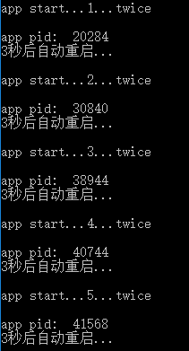

# Demo

## 1、重启窗口Widget
[运行 RestartWindow.py](RestartWindow.py)

利用类变量对窗口的变量进行引用，防止被回收（导致窗口一闪而过），重启时先显示新窗口后关闭自己

## 2、简单的窗口贴边隐藏
[运行 WeltHideWindow.py](WeltHideWindow.py)

1. 大概思路
    1. 思路是当窗口进入左边，顶部，右边一半时，此时判断窗口的坐标
    1. 如果窗口的x坐标小于0 则需要隐藏到左边
    1. 如果窗口的y坐标小于0 则需要隐藏到顶部
    1. 如果窗口的x坐标大于屏幕宽度-窗口宽度/2 则需要隐藏到右边

2. 事件说明
    1. `mousePressEvent`，鼠标按下事件，主要记录按下的坐标
    1. `mouseMoveEvent`，鼠标移动事件，用于移动窗口
    1. `mouseReleaseEvent`，鼠标弹起事件，用于判断是否需要隐藏窗口
    1. `enterEvent`，鼠标进入事件，用于窗口隐藏后，是否需要暂时显示预览
    1. `leaveEvent`，鼠标离开事件，用于窗口暂时显示后自动隐藏效果

## 3、嵌入外部窗口
[运行 EmbedWindow.py](EmbedWindow.py)

1. 使用`SetParent`函数设置外部窗口的`parent`为Qt的窗口
1. Qt使用`QWidget.createWindowContainer(QWindow.fromWinId(窗口ID))`生成QWidget
1. 使用`GetWindowLong`得到原来窗口的样式属性`style = win32gui.GetWindowLong(hwnd, win32con.GWL_STYLE)`和`exstyle = win32gui.GetWindowLong(hwnd, win32con.GWL_EXSTYLE)`
1. 这里还原窗口后不会显示，用spy++发现没有了WS_VISIBLE样式（未解决）

## 4、简单跟随其它窗口
[运行 FollowWindow.py](FollowWindow.py)

1. 利用win32gui模块获取目标窗口的句柄
1. 通过句柄获取目标窗口的大小位置，并设置自己的位置
1. 当句柄失效时关闭自己
1. 主要是检测时间，在10毫秒以下很流畅

## 5、简单探测窗口和放大截图
[运行 ProbeWindow.py](ProbeWindow.py)

1. 利用`win32gui`模块获取鼠标所在位置的窗口大小(未去掉边框)和rgb颜色
1. 利用一个全屏的全透明鼠标穿透的窗口（目的在于绘制矩形框和截图）

## 6、无边框自定义标题栏窗口
[运行 FramelessWindow.py](FramelessWindow.py) | [运行 NativeEvent.py](NativeEvent.py)

1. 重写鼠标事件

    1. 使用一个`QWidget`（`FramelessWindow`）作为父窗口, 一个`TitleBar`作为标题栏, 一个`QWidget`作为底部容器
    1. 父窗口`FramelessWindow`设置为背景透明，但是需要绘制一定宽度的透明度很高的矩形边框用来接受鼠标事件（变形鼠标样式进行调整窗口大小）
    1. `TitleBar`的最小化最大化关闭等按钮事件关联到父窗口里
    1. `TitleBar`中的鼠标按下移动事件得到坐标也传递到父窗口调用move方法进行窗口移动

2. windows api

    1. 使用`win32gui`设置薄边框
    1. 重写`nativeEvent`事件拦截边框的系统边框的显示，并返回各个方向

## 7、右下角弹出框
[运行 WindowNotify.py](WindowNotify.py)

## 8、程序重启
[运行 AutoRestart.py](AutoRestart.py)

## 9、自定义属性
[运行 CustomProperties.py](CustomProperties.py)

## 10、调用截图DLL
[运行 ScreenShotDll.py](ScreenShotDll.py)

## 11、单实例应用
[运行 SingleApplication.py](SingleApplication.py) | [运行 SharedMemory.py](SharedMemory.py)

1. QSharedMemory
2. QLocalSocket, QLocalServer

## 12、简单的右下角气泡提示
[运行 BubbleTips.py](BubbleTips.py)

1. 使用 `QWidget` 包含一个 `QLabel`, 其中 `QWidget` 通过 `paintEvent` 绘制气泡形状
2. 使用 `QPropertyAnimation` 属性动画来移动气泡和改变气泡的透明度
3. 使用 `QParallelAnimationGroup` 动画组来同时运行两个动画

## 13、右侧消息通知栏
[运行 Notification.py](Notification.py)

## 14、验证码
[运行 VerificationCode.py](VerificationCode.py)

1. 更新为paintEvent方式,采用上下跳动
2. 参考网上一些代码，都是采用paintEvent绘制，这里采用QLabel显示html结合字体来显示文字 
然后在paintEvent中绘制噪点和线条

## 15、人脸特征点
[运行 FacePoints.py](FacePoints.py)

PyQt 结合 Opencv 进行人脸检测；
由于直接在主线程中进行特征点获取，效率比较低

 依赖文件
 
1. [opencv](https://www.lfd.uci.edu/~gohlke/pythonlibs/#opencv)
2. [numpy](https://www.lfd.uci.edu/~gohlke/pythonlibs/#numpy)
3. [dlib](http://dlib.net/)
  1. [dlib-19.4.0.win32-py2.7.exe](dist/dlib-19.4.0.win32-py2.7.exe)
  2. [dlib-19.4.0.win32-py3.4.exe](dist/dlib-19.4.0.win32-py3.4.exe)
  3. [dlib-19.4.0.win32-py3.5.exe](dist/dlib-19.4.0.win32-py3.5.exe)
4. [shape-predictor-68-face-landmarks.dat.bz2](http://dlib.net/files/shape_predictor_68_face_landmarks.dat.bz2)

