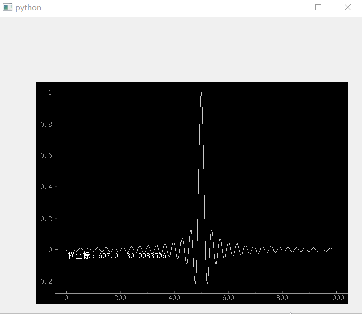
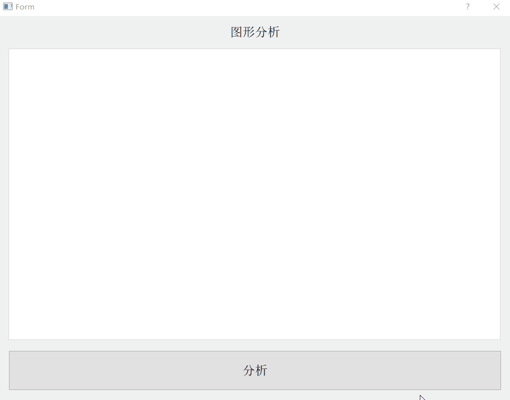
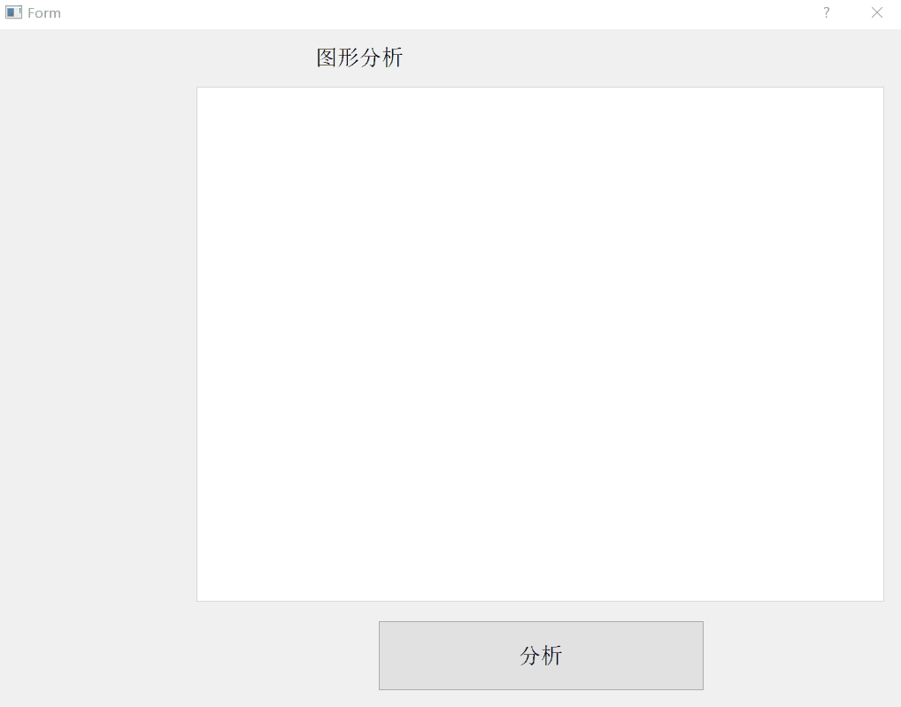

# PyQtGraph

## 说明

正在汇总Demo中,Be continued

本章节预告，实际使用中的包`PyQtGraph`相关BUG，以及解决方案，如有精力会添加相应解决方案的作者

1. `PyQtGraph`右键保存图片功能异常，以及解决防范
2. 依据`PyQtGraph` examples例子的使用心得
3. `PyQtGraph`如何禁止左键，右键，滑轮事件功能
4. 使用`QScrollArea`后添加`pg.PlotWidget()`不能选择图片尺寸问题。
5. 多图共享轴（Difficult）
6. `pg.PlotWidget()`鼠标获取X轴坐标

## 目录
- [鼠标获取X轴坐标](#1鼠标获取X轴坐标)
- [禁止右键点击功能、鼠标滚轮，添加滚动条等功能](#2禁止右键点击功能、鼠标滚轮，添加滚动条等功能)

## 1、鼠标获取X轴坐标
[运行 mouseFlow.py](mouseFlow.py)

## 2、禁止右键点击功能、鼠标滚轮，添加滚动条等功能
[运行 graph1.py](graph1.py) | [查看 graphTest.ui](Data/graphTest.ui)

## 3、不用修改源码，重加载，解决右键保存图片异常；解决自定义坐标轴密集显示；禁止鼠标事件；
[加载 tools.py](tools.py)

## 4、QScrollArea添加和修改大小例子；
[运行 testGraphAnalysis.py](testGraphAnalysis.py) | [查看 graphAnalysis.ui](Data/graphAnalysis.ui)

