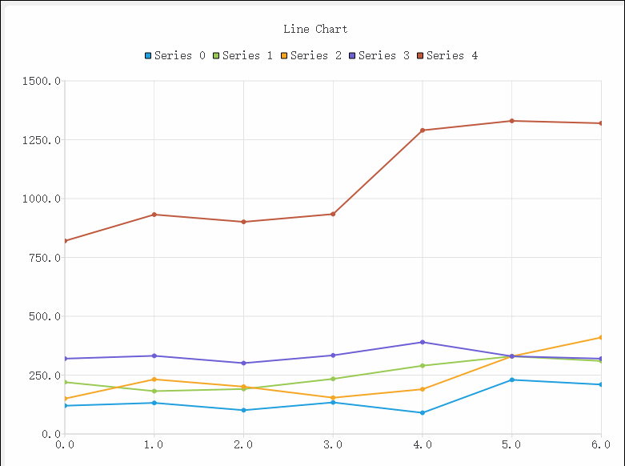

# QChart

- 目录
  - [折线图](#1、折线图)
  - [折线堆叠图](#2、折线堆叠图)
  - [柱状堆叠图](#3、柱状堆叠图)
  - [LineChart自定义xy轴](#4、LineChart自定义xy轴)
  - [ToolTip提示](#5、ToolTip提示)

## 1、折线图
[运行 LineChart.py](LineChart.py)

## 2、折线堆叠图
[运行 LineStack.py](LineStack.py)

仿照 [line-stack](http://echarts.baidu.com/demo.html#line-stack)

## 3、柱状堆叠图
[运行 BarStack.py](BarStack.py)

仿照 [bar-stack](http://echarts.baidu.com/demo.html#bar-stack)

## 4、LineChart自定义xy轴
[运行 CustomXYaxis.py](CustomXYaxis.py)

## 5、ToolTip提示
[运行 ToolTip.py](ToolTip.py) | [运行 ToolTip2.py](ToolTip2.py) 

 

## 6、动态曲线图
[运行 DynamicSpline.py](DynamicSpline.py)

