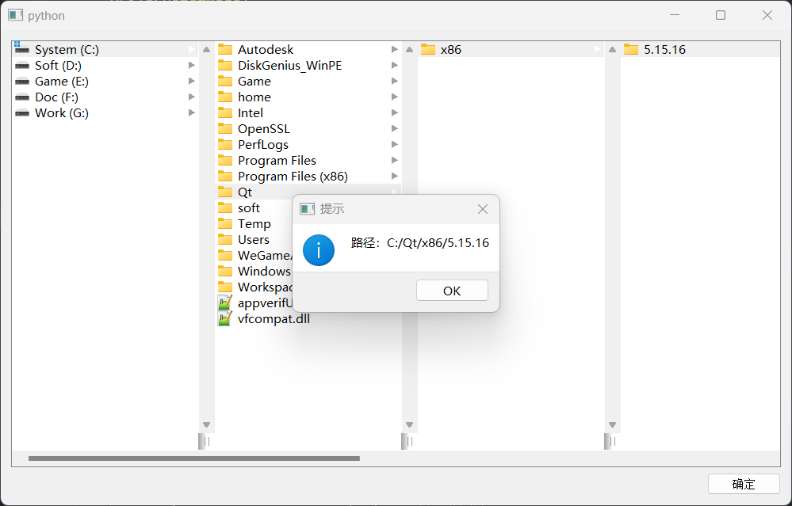

# QColumnView

- 目录
  - [文件系统浏览器](#1文件系统浏览器)

## 1、文件系统浏览器

[运行 FileManager.py](FileManager.py)

一个省市区关联的三级联动，数据源在data.json中

1. 通过`QFileSystemModel`模型来显示文件系统
2. 结合`QColumnView`的`setMode`函数显示文件系统模型
3. 通过`QFileSystemModel.filePath(QColumnView.currentIndex())`获取当前选中的路径

