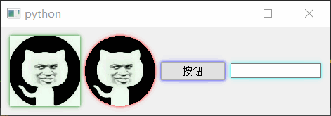

# QGraphicsDropShadowEffect

- 目录
  - [边框阴影动画](#1边框阴影动画)

## 1、边框阴影动画
[运行 ShadowEffect.py](ShadowEffect.py)

1. 通过`setGraphicsEffect`设置控件的边框阴影
2. 继承`QGraphicsDropShadowEffect`实现增加动态属性`radius`
3. 通过`QPropertyAnimation`属性动画不断改变`radius`的值并调用`setBlurRadius`更新半径值
4. 不能对父控件使用

