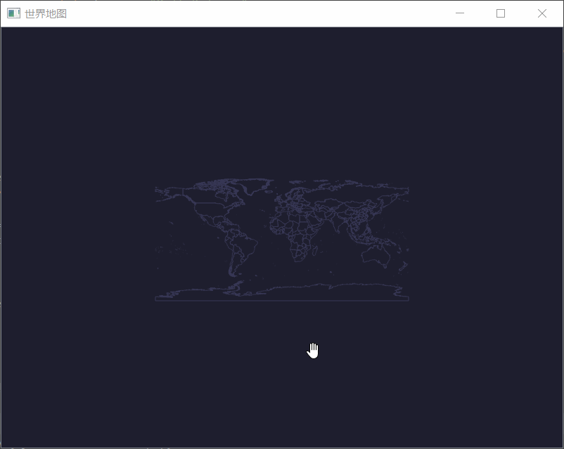
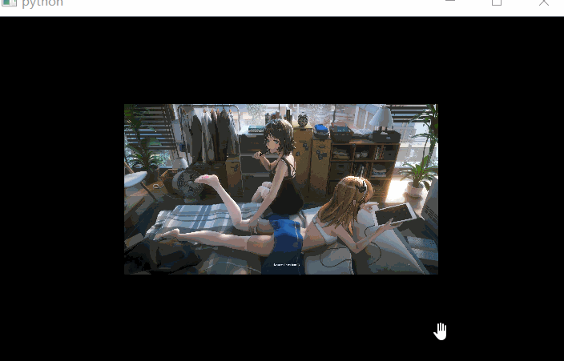
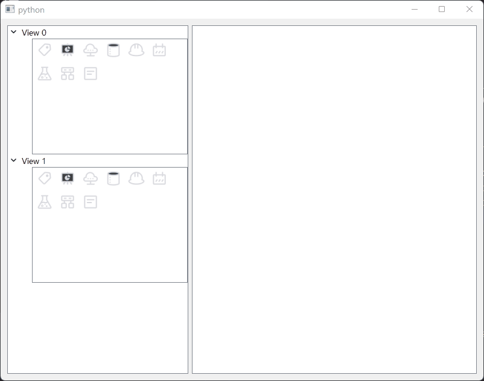

# QGraphicsView

- 目录
  - [绘制世界地图](#1绘制世界地图)
  - [添加QWidget](#2添加QWidget)
  - [图片查看器](#3图片查看器)
  - [图标拖拽](#4图标拖拽)

## 1、绘制世界地图
[运行 WorldMap.py](WorldMap.py)

1. 解析json数据生成 `QPolygonF`
2. 使用Ctrl+滑轮进行放大缩小

## 2、添加QWidget
[运行 AddQWidget.py](AddQWidget.py)

通过 `QGraphicsScene.addWidget` 添加自定义QWidget

## 3、图片查看器
[运行 ImageView.py](ImageView.py)

支持放大缩小和移动

## 3、图标拖拽
[运行 DragGraphics.py](DragGraphics.py)

该示例主要是包含左侧树状图标列表和右侧视图显示，从左侧拖拽到右侧

1. 重写`QListWidget`的`startDrag`函数用来封装拖拽数据
2. 重写`QGraphicsView`的`dragEnterEvent`、`dragMoveEvent`、`dropEvent`函数用来处理拖拽事件

