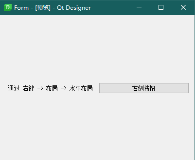
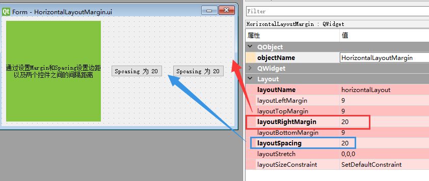
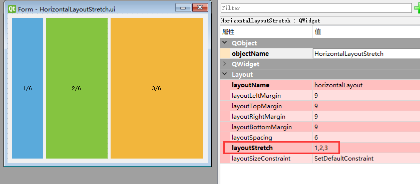

# QHBoxLayout

- 目录
  - [水平布局](#1水平布局)
  - [边距和间隔](#2边距和间隔)
  - [比例分配](#3比例分配)

## 1、水平布局
[查看 BaseHorizontalLayout.ui](Data/BaseHorizontalLayout.ui)



## 2、边距和间隔
[查看 HorizontalLayoutMargin.ui](Data/HorizontalLayoutMargin.ui)

1. 通过`setContentsMargins(-1, -1, 20, -1)`设置左上右下的边距，-1表示默认值
2. 通过`setSpacing`设置控件之间的间隔



## 3、比例分配
[查看 HorizontalLayoutStretch.ui](Data/HorizontalLayoutStretch.ui)

通过`setStretch`设置各个部分的占比 分别为：1/6 2/6 3/6

```python
self.horizontalLayout.setStretch(0, 1)
self.horizontalLayout.setStretch(1, 2)
self.horizontalLayout.setStretch(2, 3)
```

