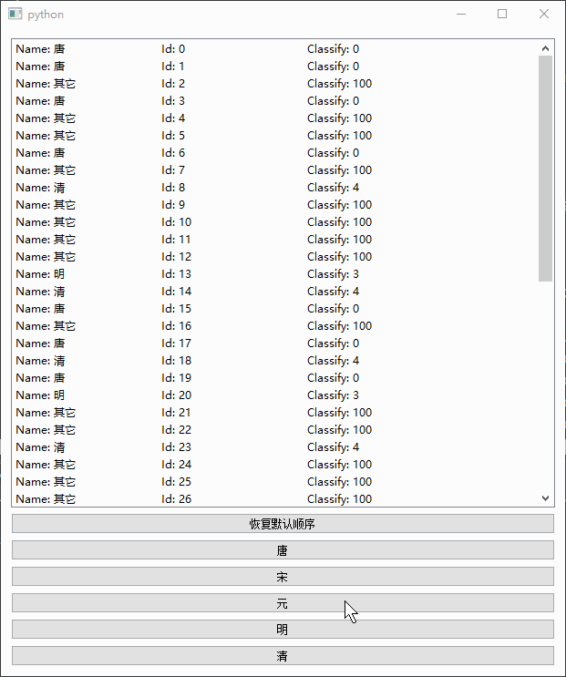

# QListView

- 目录
  - [显示自定义Widget](#1显示自定义Widget)
  - [显示自定义Widget并排序](#2显示自定义Widget并排序)
  - [自定义角色排序](#3自定义角色排序)

## 1、显示自定义Widget
[运行 CustomWidgetItem.py](CustomWidgetItem.py)

通过设置 `setIndexWidget(QModelIndex, QWidget)` 可以设置自定义 `QWidget`


## 2、显示自定义Widget并排序
[运行 CustomWidgetSortItem.py](CustomWidgetSortItem.py)

1. 对QListView设置代理 `QSortFilterProxyModel`
2. 重写model的 `lessThan` 方法进行排序


## 3、自定义角色排序
[运行 SortItemByRole.py](SortItemByRole.py)

需求：
1. 5种分类（唐、宋、元、明、清） 和 未分类
2. 选中唐则按照 唐、宋、元、明、清、未分类排序
3. 选中宋则按照 宋、唐、元、明、清、未分类排序
4. 选中元则按照 元、唐、宋、明、清、未分类排序
5. 取消排序则恢复到加载时候顺序，如：未分类、唐、唐、明、清、未分类、宋、元、未分类

思路：
1. 定义`IdRole = Qt.UserRole + 1`            用于恢复默认排序
2. 定义`ClassifyRole = Qt.UserRole + 2`      用于按照分类序号排序
3. 定义5种分类的id
    ```python
    NameDict = {
        '唐': ['Tang', 0],
        '宋': ['Song', 1],
        '元': ['Yuan', 2],
        '明': ['Ming', 3],
        '清': ['Qing', 4],
    }
    IndexDict = {
        0: '唐',
        1: '宋',
        2: '元',
        3: '明',
        4: '清',
    }
    ```
4. item设置 `setData(id, IdRole)` 用于恢复默认排序
5. item设置 `setData(cid, ClassifyRole)` 用于标识该item的分类
6. 继承 `QSortFilterProxyModel` 增加 `setSortIndex(self, index)` 方法, 目的在于记录要置顶（不参与排序）的分类ID
    ```python
    def setSortIndex(self, index):
        self._topIndex = index
    ```
7. 继承 `QSortFilterProxyModel` 重写 `lessThan` 方法, 判断分类ID是否等于要置顶的ID, 如果是则修改为-1, 这样就永远在最前面
    ```python
    if self.sortRole() == ClassifyRole and \
            source_left.column() == self.sortColumn() and \
            source_right.column() == self.sortColumn():
        # 获取左右两个的分类
        leftIndex = source_left.data(ClassifyRole)
        rightIndex = source_right.data(ClassifyRole)
    
        # 升序
        if self.sortOrder() == Qt.AscendingOrder:
            # 保持在最前面
            if leftIndex == self._topIndex:
                leftIndex = -1
            if rightIndex == self._topIndex:
                rightIndex = -1
    
            return leftIndex < rightIndex
    ```
8. 恢复默认排序
    ```python
    self.fmodel.setSortRole(IdRole)     # 必须设置排序角色为ID
    self.fmodel.sort(0)                 # 排序第一列按照ID升序
    ```
9. 根据分类排序, 这里要注意要先通过 `setSortRole` 设置其它角色再设置目标角色
    ```python
    self.fmodel.setSortIndex(1)
    self.fmodel.setSortRole(IdRole)
    self.fmodel.setSortRole(ClassifyRole)
    self.fmodel.sort(0)
    ```

