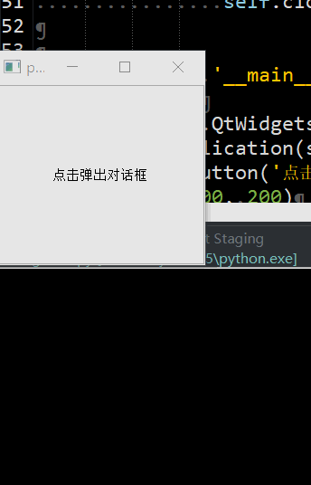
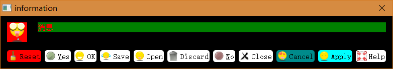
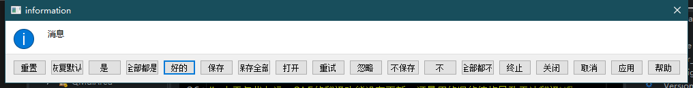

# QMessageBox

- 目录
  - [消息对话框倒计时关闭](#1消息对话框倒计时关闭)
  - [自定义图标等](#2自定义图标等)
  - [消息框按钮文字汉化](#3消息框按钮文字汉化)

## 1、消息对话框倒计时关闭
[运行 CountDownClose.py](CountDownClose.py)

1. 通过继承`QMessageBox`实现倒计时关闭的对话框
1. `QTimer`定时器关闭窗口

## 2、自定义图标等
[运行 CustomColorIcon.py](CustomColorIcon.py)

## 3、消息框按钮文字汉化
[运行 ChineseText.py](ChineseText.py)

1. 因为Qt5的翻译文件还是沿用旧的Qt4的结构导致部分地方无法翻译
2. 可以通过手动重新编译翻译文件解决问题
3. 这里可以通过QSS特性修改按钮文字，详细见代码

