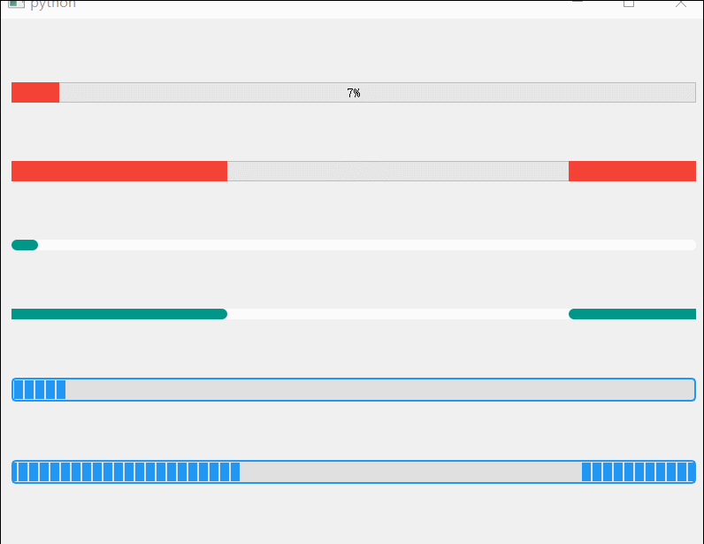
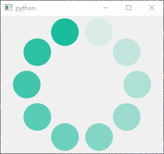
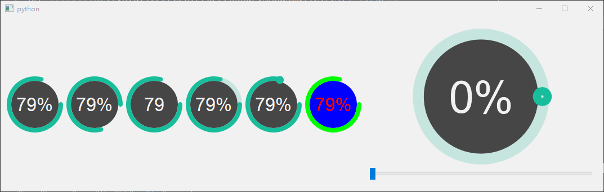
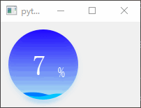
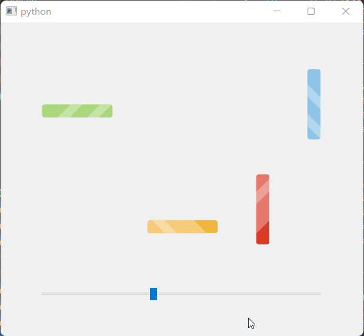

# QProgressBar

- 目录
  - [常规样式美化](#1常规样式美化)
  - [圆圈进度条](#2圆圈进度条)
  - [百分比进度条](#3百分比进度条)
  - [Metro进度条](#4Metro进度条)
  - [水波纹进度条](#5水波纹进度条)
  - [圆形水位进度条](#6圆形水位进度条)
  - [多彩动画进度条](#7多彩动画进度条)

## 1、常规样式美化
[运行 SimpleStyle.py](SimpleStyle.py)

主要改变背景颜色、高度、边框、块颜色、边框、圆角

## 2、圆圈进度条
[运行 RoundProgressBar.py](RoundProgressBar.py)

## 3、百分比进度条
[运行 PercentProgressBar.py](PercentProgressBar.py)

## 4、Metro进度条
[运行 MetroCircleProgress.py](MetroCircleProgress.py)

## 5、水波纹进度条
[运行 WaterProgressBar.py](WaterProgressBar.py)

1. 利用正弦函数根据0-width的范围计算y坐标
2. 利用 `QPainterPath` 矩形或者圆形作为背景
3. 用 `QPainterPath` 把y坐标用 `lineTo` 连接起来形成一个U字形+上方波浪的闭合区间

## 6、圆形水位进度条
[运行 WaterProgress.py](WaterProgress.py)

参考 https://github.com/linuxdeepin/dtkwidget/blob/master/src/widgets/dwaterprogress.cpp

## 7、多彩动画进度条
[运行 ColourfulProgress.py](ColourfulProgress.py)

动画实现参考 qfusionstyle.cpp 中的 CE_ProgressBarContents 绘制方法

