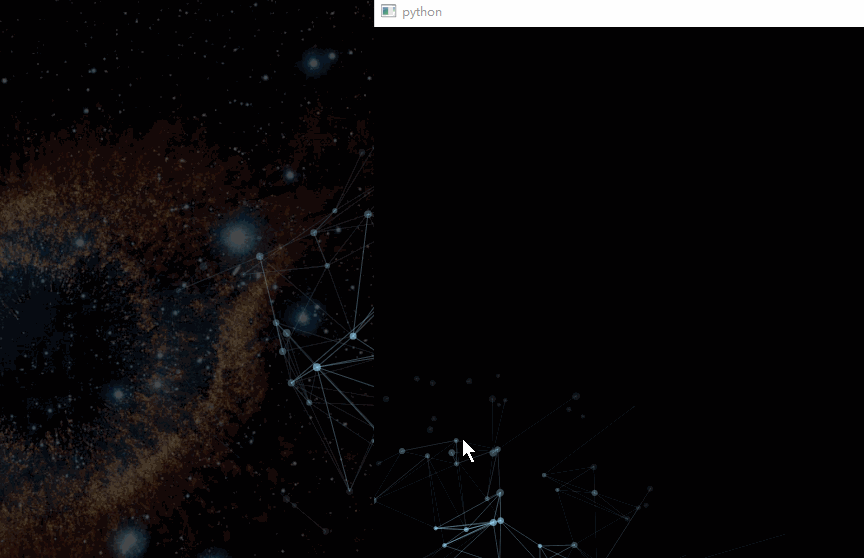
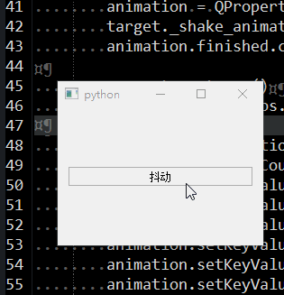
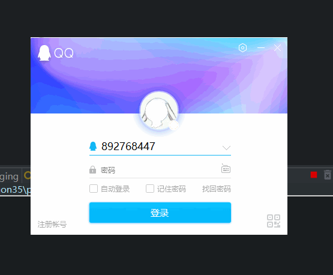

# QPropertyAnimation

- 目录
  - [窗口淡入淡出](#1窗口淡入淡出)
  - [右键菜单动画](#2右键菜单动画)
  - [点阵特效](#3点阵特效)
  - [页面切换/图片轮播动画](#4页面切换图片轮播动画)
  - [窗口抖动](#5窗口抖动)
  - [窗口翻转动画（仿QQ）](#6窗口翻转动画仿QQ)

## 1、窗口淡入淡出
[运行 FadeInOut.py](FadeInOut.py)

1. 使用`QPropertyAnimation`对窗口的`windowOpacity`透明度属性进行修改
1. 窗口启动时开启透明度0-->1的动画
    1. 尝试先取消动画完成后关闭窗口的信号（使用同一个动画对象，在关闭窗口动画的时候连接了动画结束后关闭窗口的信号）
    1. 停止旧动画开启新动画
1. 窗口关闭时开启透明度1-->0的动画
    1. 停止就动画
    1. 绑定动画完成后`finished`信号连接到`close`关闭窗口函数


   
## 2、右键菜单动画
[运行 MenuAnimation.py](MenuAnimation.py)

1. 使用`QPropertyAnimation`对菜单控件的`geometry`属性进行修改
1. 当菜单事件`contextMenuEvent`触发时调用动画启动，同时显示菜单


## 3、点阵特效
[运行 RlatticeEffect.py](RlatticeEffect.py)

1. emmm,我也不知道这个动画叫啥名字,反正就是仿照网页做的
1. 参考js源码,大概的原理就是:
    1. 先根据窗口大小随机创建一些点
    1. 遍历这些点找到跟它自己关联的点
    1. 动画开始画圆点、画连线
    1. 动画改变这些点的透明度, 用到了属性动画`QPropertyAnimation`
1. 这里没有仔细去研究js里的算法优化,在浏览器里嗖嗖的就生成了,在py里好慢....
1. 尽量在py里优化了循环操作,也简单的做了个cython加速也才提高了1s ? 1倍?...
1. 不要为了xx用这玩意儿,和网页的效果一样,占CPU !!!!!!
1. 如果有更好的优化算法请告知, 3Q
1. PS: pyd是python3.4生成的,删掉pyd也能运行

这部分是js的核心
```js
// for each point find the 5 closest points
for(var i = 0; i < points.length; i++) {
    var closest = [];
    var p1 = points[i];
    for(var j = 0; j < points.length; j++) {
        var p2 = points[j]
        if(!(p1 == p2)) {
            var placed = false;
            for(var k = 0; k < 5; k++) {
                if(!placed) {
                    if(closest[k] == undefined) {
                        closest[k] = p2;
                        placed = true;
                    }
                }
            }

            for(var k = 0; k < 5; k++) {
                if(!placed) {
                    if(getDistance(p1, p2) < getDistance(p1, closest[k])) {
                        closest[k] = p2;
                        placed = true;
                    }
                }
            }
        }
    }
    p1.closest = closest;
}
```

这部分是py的核心
```python
def findClose(points):
    plen = len(points)
    for i in range(plen):
        closest = [None, None, None, None, None]
        p1 = points[i]
        for j in range(plen):
            p2 = points[j]
            dte1 = getDistance(p1, p2)
            if p1 != p2:
                placed = False
                for k in range(5):
                    if not placed:
                        if not closest[k]:
                            closest[k] = p2
                            placed = True
                for k in range(5):
                    if not placed:
                        if dte1 < getDistance(p1, closest[k]):
                            closest[k] = p2
                            placed = True
        p1.closest = closest
```



## 4、页面切换/图片轮播动画
[运行 PageSwitching.py](PageSwitching.py) | [查看 UiImageSlider.ui](Data/UiImageSlider.ui)

1. 使用`QPropertyAnimation`对`QStackedWidget`中的子控件进行pos位移操作实现动画切换特效
1. 主要代码参考http://qt.shoutwiki.com/wiki/Extending_QStackedWidget_for_sliding_page_animations_in_Qt
1. 增加了自动切换函数

函数调用:

1. `slideInNext` 下一页
1. `slideInPrev` 上一页
1. `setCurrentIndex` 切换到指定页
1. `autoStart(msec)`  轮播模式, 默认是3000毫秒


## 5、窗口抖动
[运行 ShakeWindow.py](ShakeWindow.py)

通过`QPropertyAnimation`对控件的pos属性进行死去活来的修改



## 6、窗口翻转动画（仿QQ）
[运行 FlipWidgetAnimation.py](FlipWidgetAnimation.py)

1. 用了两个`QLabel`来显示模拟的图片界面，并实现鼠标点击模拟真实的窗口对应位置点击
2. 用了`QStackedWidget`来存放上面的两个界面`QLabel`
3. 点击切换时主要是对上面的两个界面进行截图并传递给翻转动画窗口
4. 通过`setWindowOpacity`控制主窗口的显示隐藏（保留任务栏），当然也可以用`hide`
5. 动画窗口`FlipWidget.py`主要实现两张图片的翻转显示，考虑到0-90和90-180之前的情况，以及图片的缩放动画

