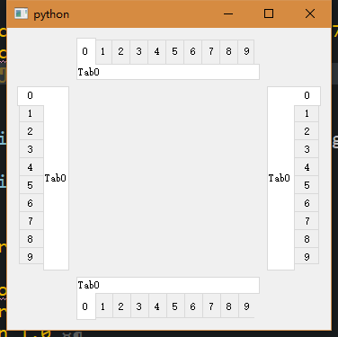
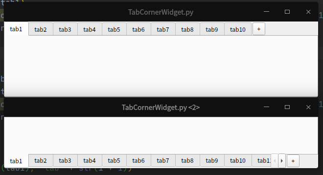

# QProxyStyle

- 目录
  - [QTabWidget Tab文字方向](#1qtabwidget-tab文字方向)
  - [QTabWidget 角落控件位置](#2qtabwidget-角落控件位置)

## 1、QTabWidget Tab文字方向
[运行 TabTextDirection.py](TabTextDirection.py)

1. 通过 `app.setStyle(TabBarStyle())` 设置代理样式
2. `sizeFromContents` 转置size
3. `drawControl` 绘制文字

## 2、QTabWidget 角落控件位置
[运行 TabCornerWidget.py](TabCornerWidget.py)

1. 通过 `app.setStyle(TabCornerStyle())` 设置代理样式
2. `setCornerWidget` 设置自定义角落控件

原理是通过代理样式中对 `SE_TabWidgetRightCorner` 计算的结果进行校正,使得角落控件占满右边空白位置,
然后再配合自定义控件中使用 `QSpacerItem` 占据右边位置使得 + 号按钮居左,表现效果为 + 号按钮跟随标签的增加和减少

