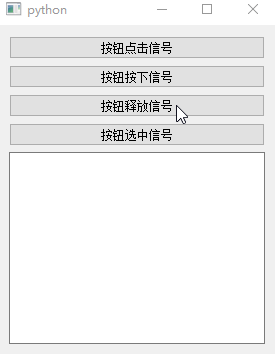
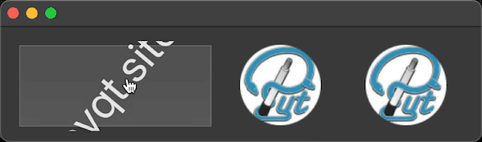
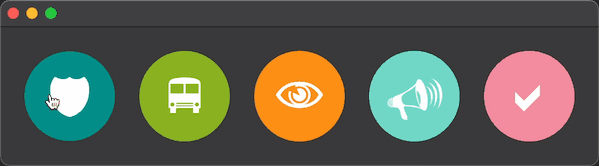

# QPushButton

- 目录
  - [普通样式](#1普通样式)
  - [按钮底部线条进度](#2按钮底部线条进度)
  - [按钮文字旋转进度](#3按钮文字旋转进度)
  - [按钮常用信号](#4按钮常用信号)
  - [旋转动画按钮](#5旋转动画按钮)
  - [弹性动画按钮](#6弹性动画按钮)

## 1、普通样式
[运行 NormalStyle.py](NormalStyle.py)

主要改变背景颜色、鼠标按下颜色、鼠标悬停颜色、圆角、圆形、文字颜色

## 2、按钮底部线条进度
[运行 BottomLineProgress.py](BottomLineProgress.py)

在按钮下方画一条线，根据百分值绘制

## 3、按钮文字旋转进度
[运行 FontRotate.py](FontRotate.py)

利用字体，使用FontAwesome字体来显示一个圆形进度条，然后利用旋转动画

## 4、按钮常用信号
[运行 SignalsExample.py](SignalsExample.py)

根据官网文档 https://doc.qt.io/qt-5/qabstractbutton.html#signals 中的信号介绍编写
按钮的点击、按下、释放、选中信号演示

## 5、旋转动画按钮
[运行 RotateButton.py](RotateButton.py)

## 6、弹性动画按钮
[运行 RubberBandButton.py](RubberBandButton.py)

