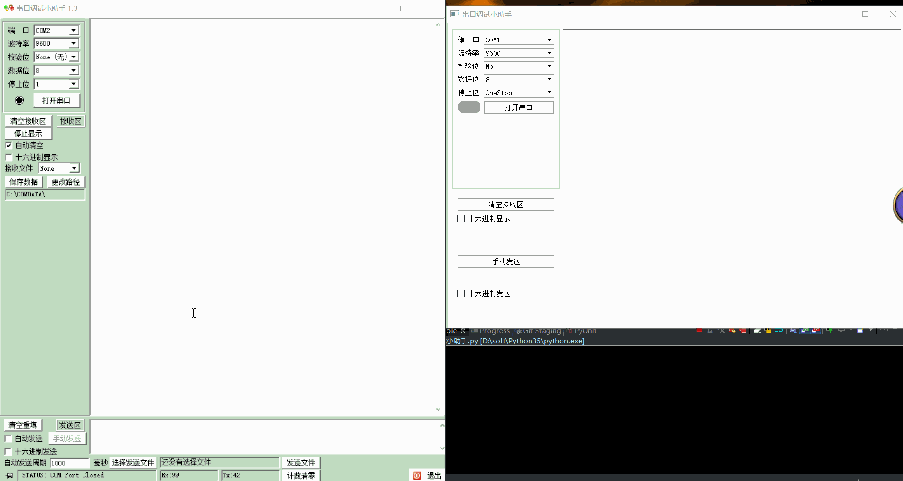

# QSerialPort

- 目录
  - [串口调试小助手](#1串口调试小助手)

## 1、串口调试小助手
[运行 SerialDebugAssistant.py](SerialDebugAssistant.py) | [查看 UiSerialPort.ui](Data/UiSerialPort.ui)

用`QSerialPort`写了个类似串口调试小助手的工具, 这个类的官方资料: http://doc.qt.io/qt-5/qserialport.html

1. 通过`QSerialPortInfo.availablePorts()` 获取所有可用的串口
1. `QSerialPort.setPortName` 设置串口名
1. `QSerialPort.setBaudRate` 设置波特率
1. `QSerialPort.setParity`   设置校验位
1. `QSerialPort.setDataBits` 设置数据位
1. `QSerialPort.setStopBits` 设置停止位
1. `QSerialPort.setFlowControl` 设置流控制

