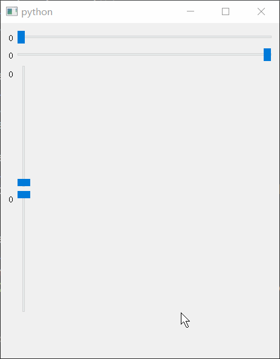
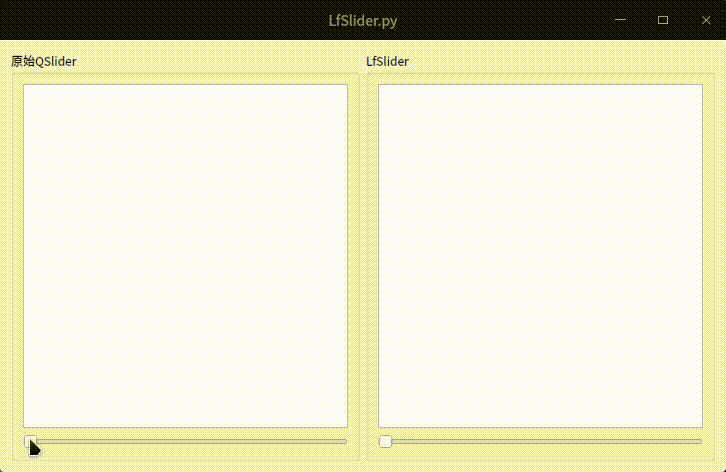

# QSlider

- 目录
  - [滑动条点击定位](#1滑动条点击定位)
  - [双层圆环样式](#2双层圆环样式)
  - [低频率值变化](#3低频率值变化)

## 1、滑动条点击定位
[运行 ClickJumpSlider.py](ClickJumpSlider.py)

1. `QSlider`对鼠标点击然后跳转到该位置的支持不是很好，通过重写鼠标点击事件`mousePressEvent`来达到效果
2. 通过`style`的`subControlRect`方法计算得到滑块的区域，当鼠标点击区域在此次时则交给系统自己处理（比如按住不放拖动）
3. 通过`orientation`判断滑动条的方向（横竖）
4. 通过`invertedAppearance`判断滑动条是否反向（左右、上下）

```python
def mousePressEvent(self, event):
    # 获取上面的拉动块位置
    option = QStyleOptionSlider()
    self.initStyleOption(option)
    rect = self.style().subControlRect(
        QStyle.CC_Slider, option, QStyle.SC_SliderHandle, self)
    if rect.contains(event.pos()):
        # 如果鼠标点击的位置在滑块上则交给Qt自行处理
        super(JumpSlider, self).mousePressEvent(event)
        return
    if self.orientation() == Qt.Horizontal:
        # 横向，要考虑invertedAppearance是否反向显示的问题
        self.setValue(self.style().sliderValueFromPosition(
            self.minimum(), self.maximum(),
            event.x() if not self.invertedAppearance() else (self.width(
            ) - event.x()), self.width()))
    else:
        # 纵向
        self.setValue(self.style().sliderValueFromPosition(
            self.minimum(), self.maximum(),
            (self.height() - event.y()) if not self.invertedAppearance(
            ) else event.y(), self.height()))
```



## 2、双层圆环样式
[运行 QssQSlider.py](QssQSlider.py) | [运行 PaintQSlider.py](PaintQSlider.py)


## 3、低频率值变化
[运行 LfSlider.py](LfSlider.py) 

覆盖了`valueChanged`信号，通过使用定时器来延迟发送值变化，如果无法覆盖信号则可以自定义一个新的信号


