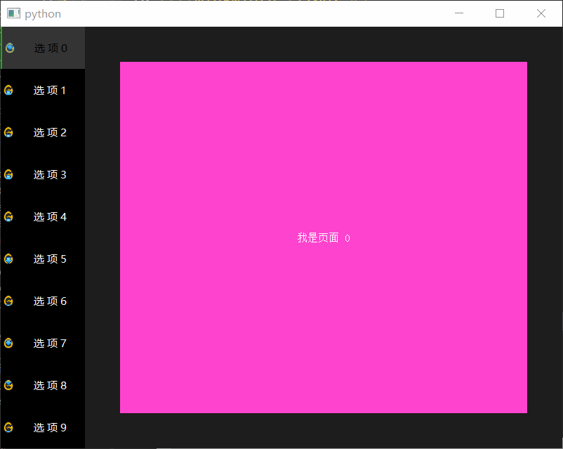

# QStackedWidget

- 目录
  - [左侧选项卡](#1左侧选项卡)

## 1、左侧选项卡
[运行 LeftTabStacked.py](LeftTabStacked.py)

本来使用`QTabWidget`可以实现多标签页面，但是当标签在左侧时会出现文字方向不对的问题，

可以通过自定义`QTabBar`来解决，也可以采用`QListWidget`结合`QStackedWidget`的方式。

1. 左侧为`QListWidget`，右侧使用`QStackedWidget`，然后依次往里面添加`QWidget`
2. 右侧添加`QWidget`的时候有两种方案
    1. 左侧list根据序号来索引，右侧添加widget时给定带序号的变量名，如widget_0,widget_1,widget_2之类的，这样可以直接根据`QListWidget`的序号关联起来
    2. 左侧list添加item时给定右侧对应的widget变量值
    
PS: 用设计设的做法 : https://www.jianshu.com/p/dac62b5c225c

