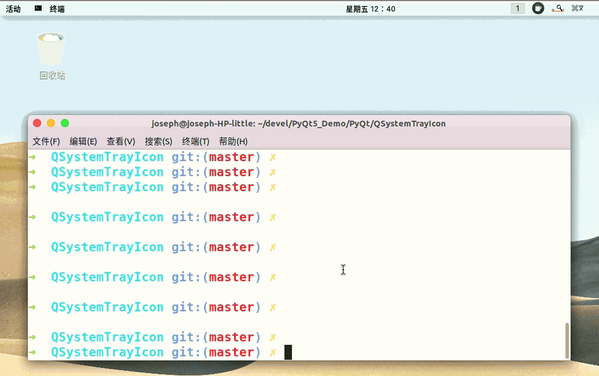

# QSystemTrayIcon

- 目录
  - [最小化到系统托盘](#1最小化到系统托盘)
  - [系统托盘闪烁](#2系统托盘闪烁)

## 1、最小化到系统托盘

[运行 MinimizeToTray.py](MinimizeToTray.py)

选择 Minimize to Tray 在关闭窗口时最小化到系统托盘。

> Reference: https://evileg.com/en/post/68/

## 2、系统托盘闪烁

[运行 TrayNotify.py](TrayNotify.py)

通过定时器设置不同图标来实现闪烁。