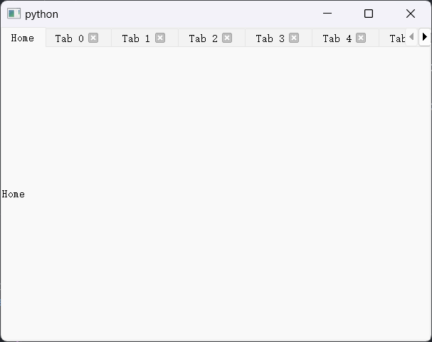

# QTabWidget

- 目录
  - [隐藏指定Tab关闭按钮](#1隐藏指定Tab关闭按钮)

## 1、隐藏指定Tab关闭按钮

[运行 HideCloseButton.py](HideCloseButton.py)

```python
btn = self.tabBar().tabButton(0, QTabBar.RightSide)
btn.close()
self.tabBar().setTabButton(0, QTabBar.RightSide, None)
```


