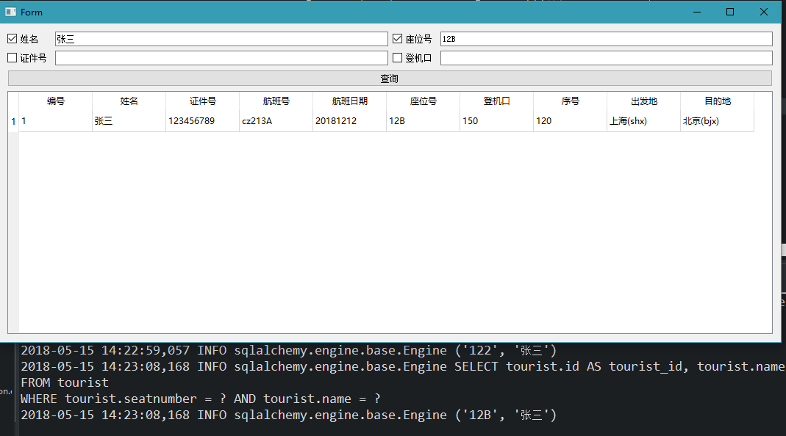
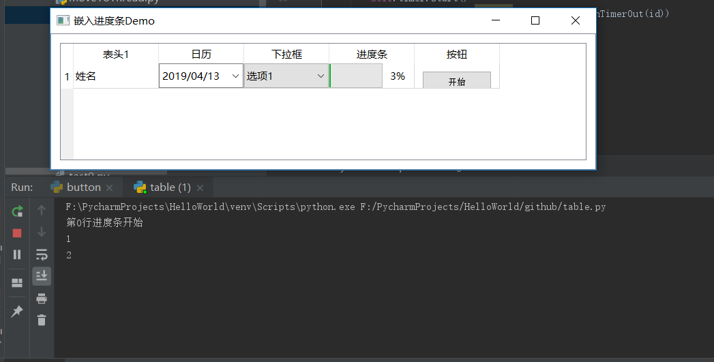

# QTableWidget

- 目录
  - [Sqlalchemy动态拼接字段查询显示表格](#1Sqlalchemy动态拼接字段查询显示表格)
  - [表格嵌入日历，下拉框，进度条，按钮](#2表格嵌入)

## 1、Sqlalchemy动态拼接字段查询显示表格
[运行 SqlQuery.py](SqlQuery.py) | [查看 mainui.ui](Data/mainui.ui)

通过判断界面中选择的条件对`Sqlalchemy`的`model`进行字段拼接从而实现按条件查询

## 2、TableWidget嵌入部件
[运行 TableWidget.py](TableWidget.py)
点击开始按钮，进度条开始

