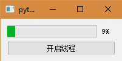
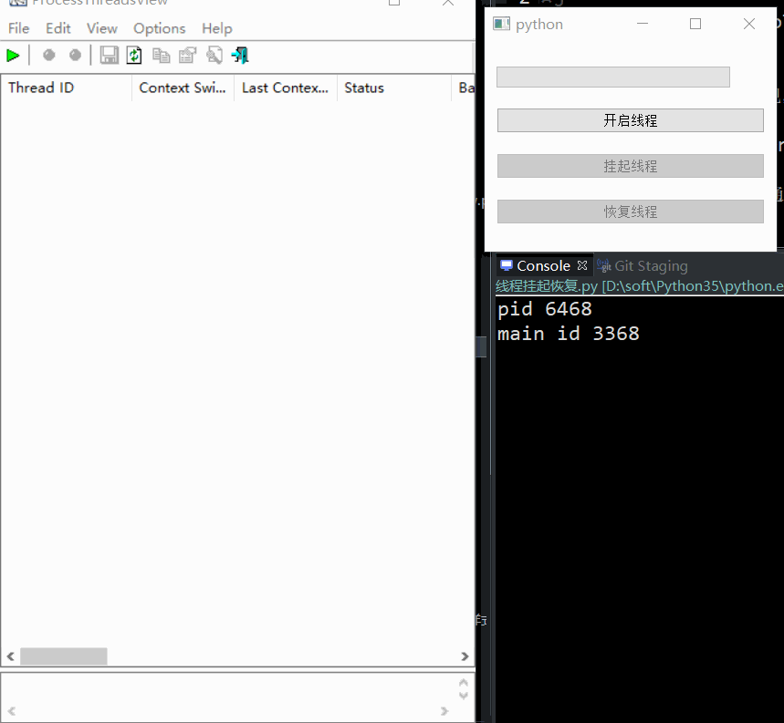
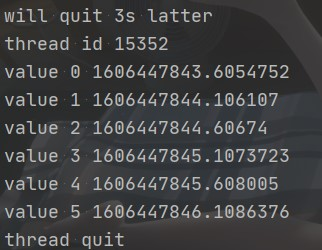

# QThread

- 目录
  - [继承QThread](#1继承QThread)
  - [moveToThread](#2moveToThread)
  - [线程挂起恢复](#3线程挂起恢复)
  - [线程休眠唤醒](#4线程休眠唤醒)
  - [线程退出](#5线程退出)

## 1、继承QThread
[运行 InheritQThread.py](InheritQThread.py)

## 2、moveToThread
[运行 moveToThread.py](moveToThread.py)

## 3、线程挂起恢复
[运行 SuspendThread.py](SuspendThread.py)

注意，这里只是简单演示，在应用这些代码时要小心

1. 这里使用windows的api实现，主要用到`SuspendThread`和`ResumeThread`函数
1. 利用`ctypes.windll.kernel32.OpenThread(win32con.PROCESS_ALL_ACCESS, False, int(QThread.currentThreadId()))`
1. 得到线程的句柄，然后就可以通过上面的两个函数对其进行挂起与恢复

`ctypes.windll.kernel32.TerminateThread`终止线程，不推荐

## 4、线程休眠唤醒
[运行 WakeupThread.py](WakeupThread.py)

使用 `QWaitCondition` 的 `wait` 和 `wakeAll` 方法

## 5、线程退出
[运行 QuitThread.py](QuitThread.py)

`isInterruptionRequested` 和 `requestInterruption` 函数作为退出标识调用

