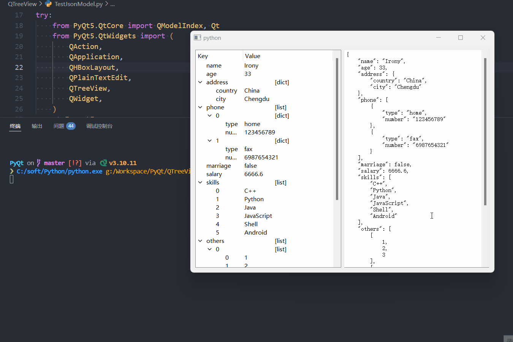
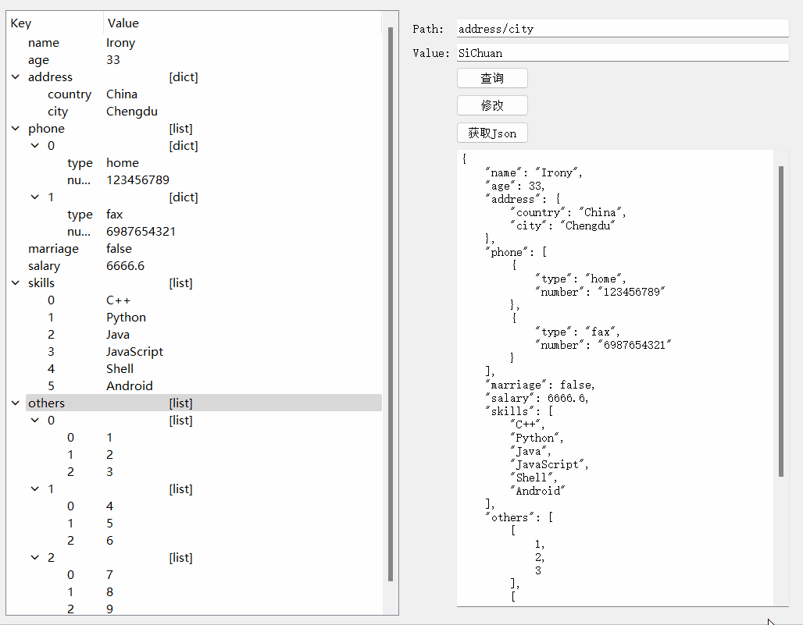
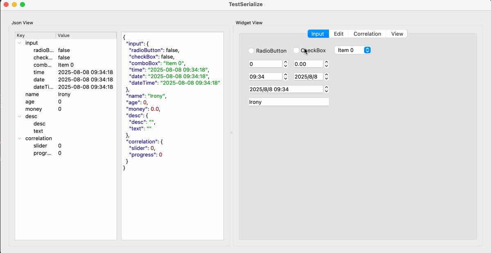

# QTreeView

- 目录
  - [通过json数据生成树形结构](#1通过json数据生成树形结构)
  - [json树形结构查询和修改](#2json树形结构查询和修改)
  - [json数据绑定](#3json数据绑定)

## 1、通过json数据生成树形结构

[运行 TestJsonModel.py](TestJsonModel.py)

## 2、json树形结构查询和修改

[运行 TestModelModify.py](TestModelModify.py)

## 3、json数据绑定

[运行 TestSerializeModel.py](TestSerializeModel.py)

