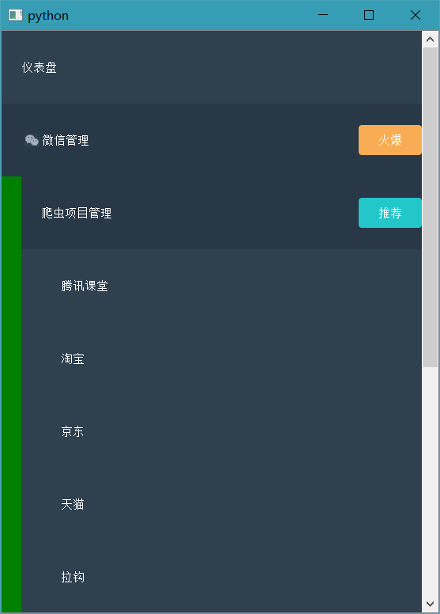
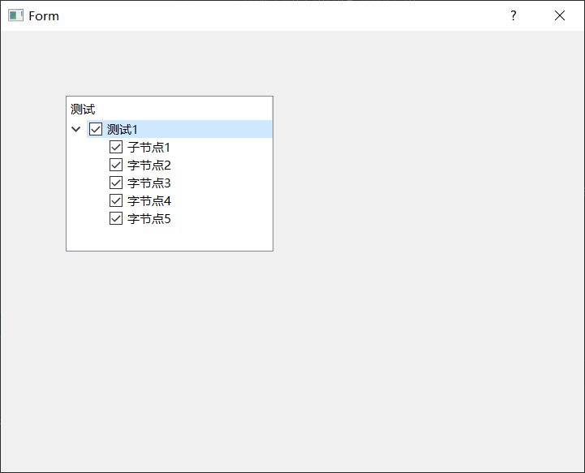
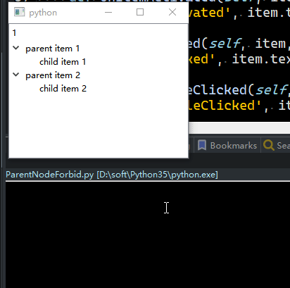

# QTreeWidget

- 目录
  - [通过json数据生成树形结构](#1通过json数据生成树形结构)
  - [点击父节点全选/取消全选子节点](#2点击父节点全选取消全选子节点)
  - [禁止父节点/禁止父节点](#3禁止父节点)

## 1、通过json数据生成树形结构
[运行 ParsingJson.py](ParsingJson.py)

解析每一层json数据中的list

## 2、点击父节点全选/取消全选子节点
[运行 testTreeWidget.py](testTreeWidget.py) | [查看 testTree.ui](Data/testTree.ui)

点击父节点全选/取消全选子节点

## 3、禁止父节点
[运行 ParentNodeForbid.py](ParentNodeForbid.py)

 1. 父节点通过设置`pitem1.setFlags(pitem1.flags() & ~Qt.ItemIsSelectable)`为不可选
 2. 完全禁用点击等需要重写`mousePressEvent`事件并结合item的标志来判断

