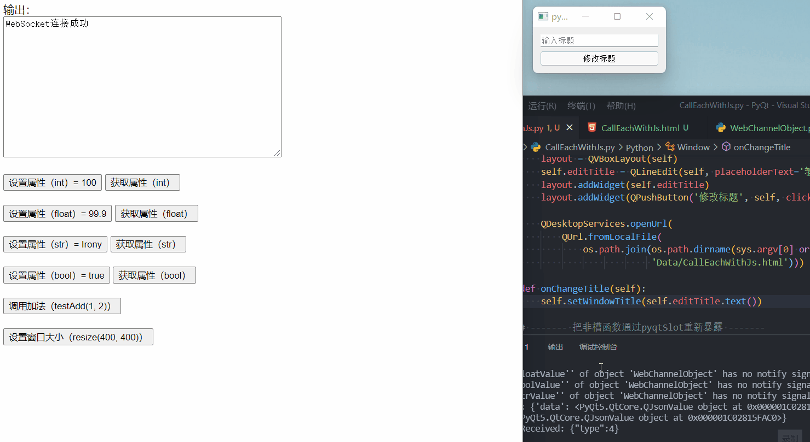

# QWebChannel

- 目录
  - [和Js互相调用](#1和Js互相调用)

## 1、和Js互相调用
[运行 CallEachWithJs.py](CallEachWithJs.py)

通过`qwebchannel.js`和`QWebChannel.registerObject`通过中间件`WebSocket`进行对象和Javascript的交互（类似于json rpc）
该方法类似与`QWebEngineView`中的例子，同时该demo也适用与nodejs。

