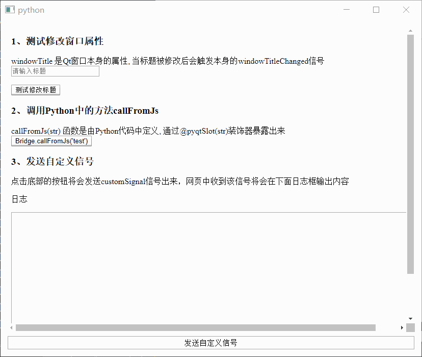

# QWebView

- 目录
  - [梦幻树](#1梦幻树)
  - [获取Cookie](#2获取Cookie)
  - [和Js交互操作](#3和Js交互操作)
  - [网页整体截图](#4网页整体截图)

## 1、梦幻树
[运行 DreamTree.py](DreamTree.py)

在桌面上显示透明html效果，使用`QWebkit`加载html实现,采用窗口背景透明和穿透方式

## 2、获取Cookie
[运行 GetCookie.py](GetCookie.py)

从`page()`中得到`QNetworkAccessManager`,在从中得到`QNetworkCookieJar`,
最后得到cookie,当然也可以设置自己的`QNetworkCookieJar`

## 3、和Js交互操作
[运行 JsSignals.py](JsSignals.py)

通过`QWebFrame`的`addToJavaScriptWindowObject`函数提供进行Python对象和Javascript的交互

具体看代码中的注释

## 4、网页整体截图
[运行 ScreenShotPage.py](ScreenShotPage.py)

原理是通过`QWebView.QWebPage.QWebFrame`得到内容的高度，然后设置`QWebPage.setViewportSize`的大小，
最后通过`QWebFrame.render`把图片截出来

