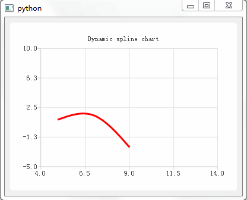
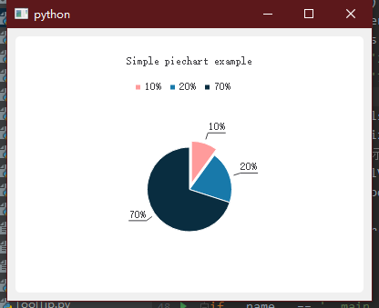
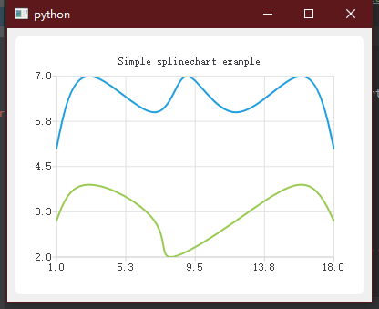
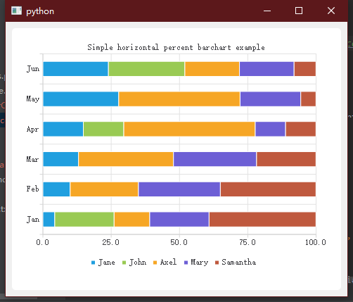
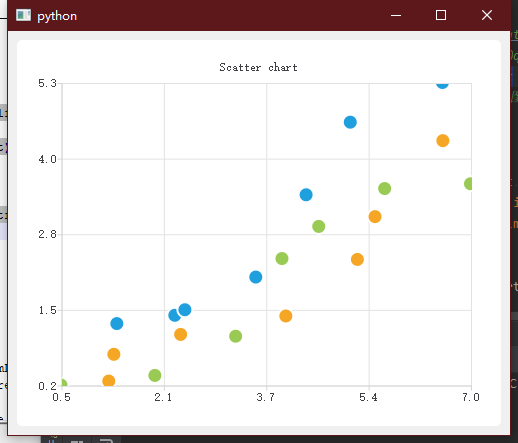
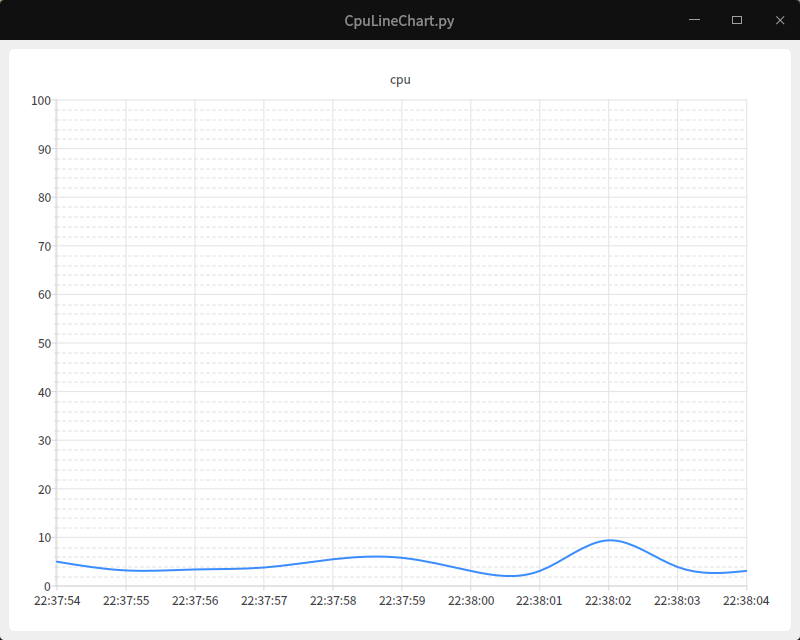

# QtChart

- 目录
  - [折线图](#1折线图)
  - [折线堆叠图](#2折线堆叠图)
  - [柱状堆叠图](#3柱状堆叠图)
  - [LineChart自定义xy轴](#4LineChart自定义xy轴)
  - [ToolTip提示](#5ToolTip提示)
  - [动态曲线图](#6动态曲线图)
  - [区域图表](#7区域图表)
  - [柱状图表](#8柱状图表)
  - [饼状图表](#9饼状图表)
  - [样条图表](#10样条图表)
  - [百分比柱状图表](#11百分比柱状图表)
  - [横向柱状图表](#12横向柱状图表)
  - [横向百分比柱状图表](#13横向百分比柱状图表)
  - [散点图表](#14散点图表)
  - [图表主题动画](#15图表主题动画)
  - [CPU动态折线图](#16CPU动态折线图)

## 1、折线图
[运行 LineChart.py](LineChart.py)

## 2、折线堆叠图
[运行 LineStack.py](LineStack.py)

仿照 [line-stack](http://echarts.baidu.com/demo.html#line-stack)

## 3、柱状堆叠图
[运行 BarStack.py](BarStack.py)

仿照 [bar-stack](http://echarts.baidu.com/demo.html#bar-stack)

## 4、LineChart自定义xy轴
[运行 CustomXYaxis.py](CustomXYaxis.py)

## 5、ToolTip提示
[运行 ToolTip.py](ToolTip.py) | [运行 ToolTip2.py](ToolTip2.py) 

 

## 6、动态曲线图
[运行 DynamicSpline.py](DynamicSpline.py)

## 7、区域图表
[运行 AreaChart.py](AreaChart.py)

## 8、柱状图表
[运行 BarChart.py](BarChart.py)

## 9、饼状图表
[运行 PieChart.py](PieChart.py)

## 10、样条图表
[运行 SplineChart.py](SplineChart.py)

## 11、百分比柱状图表
[运行 PercentBarChart.py](PercentBarChart.py)

## 12、横向柱状图表
[运行 HorizontalBarChart.py](HorizontalBarChart.py)

## 13、横向百分比柱状图表
[运行 HorizontalPercentBarChart.py](HorizontalPercentBarChart.py)

## 14、散点图表
[运行 ScatterChart.py](ScatterChart.py)

## 15、图表主题动画
[运行 ChartThemes.py](ChartThemes.py)

## 16、CPU动态折线图
[运行 CpuLineChart.py](CpuLineChart.py)

通过设置x轴的时间范围并替换y点达到动态移动效果

