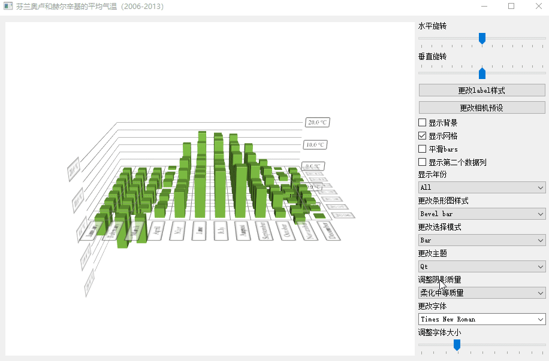
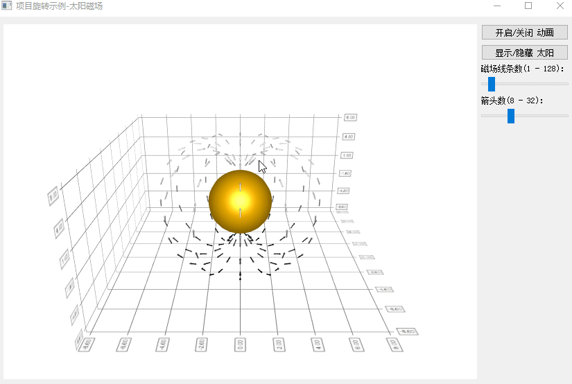
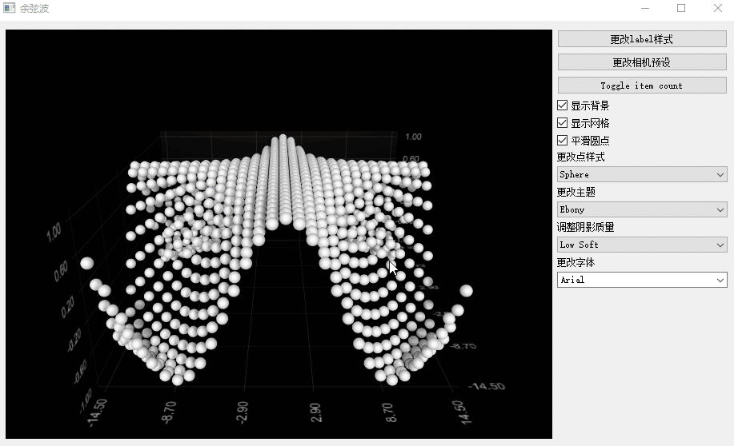

# QtDataVisualization

- 目录
  - [柱状图3D](#1柱状图3D)
  - [太阳磁场线](#2太阳磁场线)
  - [余弦波3D](#3余弦波3D)

## 1、柱状图3D
[运行 BarsVisualization.py](BarsVisualization.py)

## 2、太阳磁场线
[运行 MagneticOfSun.py](MagneticOfSun.py)

## 3、余弦波3D
[运行 ScatterVisualization.py](ScatterVisualization.py)

