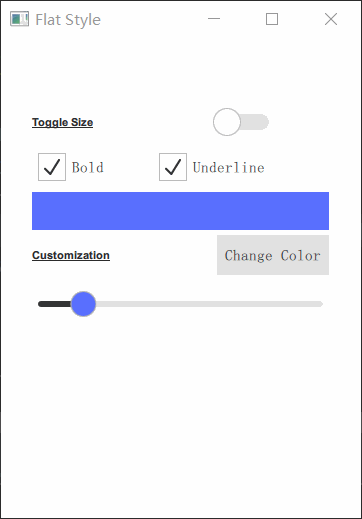
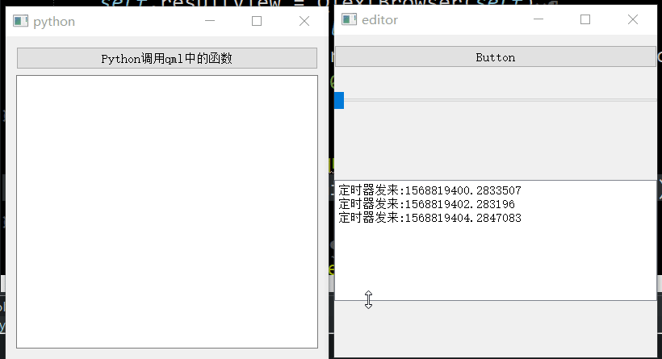

# QtQuick

- 目录
  - [Flat样式](#1Flat样式)
  - [QML与Python交互](#2QML与Python交互)

## 1、Flat样式
[运行 FlatStyle.py](FlatStyle.py)



## 2、QML与Python交互
[运行 Signals.py](Signals.py)

交互的办法有很多种，由于主要界面功能都是有QML来实现，Python只是作为辅助提供部分功能。
于是和浏览器中js与python交互方式类似，提供一个Python对象给QML访问。

1. 通过 `engine.rootContext().setContextProperty('_Window', w)` 注册提供一个Python对象
2. Python对象中被访问的方法前面使用装饰器 `@pyqtSlot`，比如： `@pyqtSlot(int)` 或者 `@pyqtSlot(str, result=str)  # 可以获取返回值` 。
3. QML中的信号或者Python对象中的信号都可以互相绑定对方的槽函数
```js
Component.onCompleted: {
    // 绑定信号槽到python中的函数
    valueChanged.connect(_Window.onValueChanged)
    // 绑定python中的信号到qml中的函数
    _Window.timerSignal.connect(appendText)
}
```



