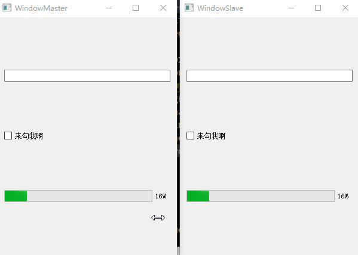

# QtRemoteObjects

- 目录
  - [modelview](#1modelview)
  - [simpleswitch](#2simpleswitch)
  - [简单界面数据同步](#3简单界面数据同步)

## 1、modelview
[运行 modelviewserver.py](modelview/modelviewserver.py) | [运行 modelviewclient.py](modelview/modelviewclient.py)

官方关于QTreeView/QStandardItemModel的同步model例子

## 2、simpleswitch
[运行 directconnectdynamicserver.py](simpleswitch/directconnectdynamicserver.py) | [运行 directconnectdynamicclient.py](simpleswitch/directconnectdynamicclient.py)

[运行 registryconnecteddynamicserver.py](simpleswitch/registryconnecteddynamicserver.py) | [运行 registryconnecteddynamicclient.py](simpleswitch/registryconnecteddynamicclient.py)

官方关于简单的信号槽、属性访问测试例子

## 3、简单界面数据同步
[运行 WindowMaster.py](SyncUi/WindowMaster.py) | [运行 WindowSlave.py](SyncUi/WindowSlave.py)

绑定信号槽同步双方数据，属性方法测试没通过，详细注释在代码中

