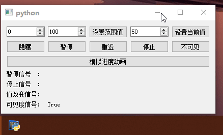

# QtWinExtras

- 目录
  - [任务栏进度条](#1任务栏进度条)
  - [任务栏缩略图工具按钮](#2任务栏缩略图工具按钮)

## 1、任务栏进度条
[运行 TaskbarProgress.py](TaskbarProgress.py)

`QWinTaskbarProgress`类似和`QProgressBar`一样的操作

## 2、任务栏缩略图工具按钮
[运行 ThumbnailToolBar.py](ThumbnailToolBar.py)

`QWinThumbnailToolBar`和`QWinThumbnailToolButton`的组合实现音乐播放器的播放、上下一曲按钮

