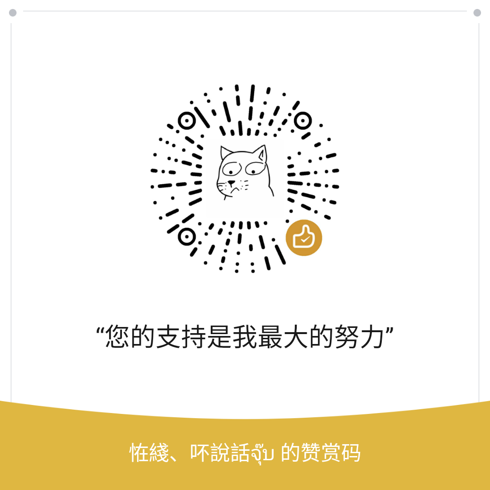

# 各种各样的PyQt测试和例子

[https://pyqt.site](https://pyqt.site) 论坛是专门针对PyQt5学习和提升开设的网站，分享大家平时学习中记录的笔记和例子，以及对遇到的问题进行收集整理。

如果您觉得这里的东西对您有帮助，别忘了帮忙点一颗:star:小星星:star:

[客户端下载](https://github.com/PyQt5/PyQtClient/releases) | [自定义控件](https://github.com/PyQt5/CustomWidgets)

## QQ群

 or 

　　　　　　　[PyQt 学习](https://jq.qq.com/?_wv=1027&k=5QVVEdF)
　　　　　　　　
　　　　　　　[PyQt 频道](https://pd.qq.com/s/157c1hiay)

## 状态

## 目录

- Layouts
  - [QVBoxLayout](QVBoxLayout)
    - [垂直布局](QVBoxLayout#1垂直布局)
    - [边距和间隔](QVBoxLayout#2边距和间隔)
    - [比例分配](QVBoxLayout#3比例分配)
  - [QHBoxLayout](QHBoxLayout)
    - [水平布局](QHBoxLayout#1水平布局)
    - [边距和间隔](QHBoxLayout#2边距和间隔)
    - [比例分配](QHBoxLayout#3比例分配)
  - [QGridLayout](QGridLayout)
    - [音乐热歌列表](QGridLayout/HotPlaylist.py)
  - [QFormLayout](QFormLayout)
  - [QFlowLayout](QFlowLayout)
    - [音乐热歌列表](QFlowLayout/HotPlaylist.py)

- Spacers
  - [Horizontal Spacer](QSpacerItem)
  - [Vertical Spacer](QSpacerItem)

- Buttons
  - [QPushButton](QPushButton)
    - [普通样式](QPushButton/NormalStyle.py)
    - [按钮底部线条进度](QPushButton/BottomLineProgress.py)
    - [按钮文字旋转进度](QPushButton/FontRotate.py)
    - [按钮常用信号](QPushButton/SignalsExample.py)
    - [旋转动画按钮](QPushButton/RotateButton.py)
    - [弹性动画按钮](QPushButton/RubberBandButton.py)
  - [QToolButton](QToolButton)
  - [QRadioButton](QRadioButton)
  - [QCheckBox](QCheckBox)

- Item Views
  - [QListView](QListView)
    - [显示自定义Widget](QListView/CustomWidgetItem.py)
    - [显示自定义Widget并排序](QListView/CustomWidgetSortItem.py)
    - [自定义角色排序](QListView/SortItemByRole.py)
  - [QTreeView](QTreeView)
  - [QTableView](QTableView)
    - [表格内容复制](QTableView/CopyContent.py)
  - [QColumnView](QColumnView)
    - [文件系统浏览器](QColumnView/FileManager.py)
  - [QUndoView](QUndoView)

- Item Widgets
  - [QListWidget](QListWidget)
    - [删除自定义Item](QListWidget/DeleteCustomItem.py)
    - [自定义可拖拽Item](QListWidget/DragDrop.py)
    - [音乐热歌列表](QListWidget/HotPlaylist.py)
    - [仿折叠控件效果](QListWidget/FoldWidget.py)
    - [列表常用信号](QListWidget/SignalsExample.py)
    - [在item中添加图标](Test/partner_625781186/13.combo_listwidget)
  - [QTreeWidget](QTreeWidget)
    - [通过json数据生成树形结构](QTreeWidget/ParsingJson.py)
    - [拖拽显示为图片](Test/partner_625781186/12.1拖拽显示为图片)
    - [点击父节点全选/取消全选子节点](QTreeWidget/testTreeWidget.py)
    - [禁止父节点](QTreeWidget/ParentNodeForbid.py)
  - [QTableWidget](QTableWidget)
    - [Sqlalchemy动态拼接字段查询显示表格](QTableWidget/SqlQuery.py)
    - [TableWidget嵌入部件](QTableWidget/TableWidget.py)

- Containers
  - [QGroupBox](QGroupBox)
  - [QScrollArea](QScrollArea)
    - [仿QQ设置面板](QScrollArea/QQSettingPanel.py)
  - [QToolBox](QToolBox)
  - [QTabWidget](QTabWidget)
  - [QStackedWidget](QStackedWidget)
    - [左侧选项卡](QStackedWidget/LeftTabStacked.py)
  - [QFrame](QFrame)
  - [QWidget](QWidget)
    - [样式表测试](QWidget/WidgetStyle.py)
  - [QMdiArea](QMdiArea)
  - [QDockWidget](QDockWidget)

- Input Widgets
  - [QComboBox](QComboBox)
    - [下拉数据关联](QComboBox/CityLinkage.py)
    - [文本居中显示](QComboBox/CenterText.py)
  - [QFontComboBox](QFontComboBox)
  - [QLineEdit](QLineEdit)
  - [QTextEdit](QTextEdit)
    - [文本查找高亮](QTextEdit/HighlightText.py)
  - [QPlainTextEdit](QPlainTextEdit)
  - [QSpinBox](QSpinBox)
  - [QDoubleSpinBox](QDoubleSpinBox)
  - [QTimeEdit](QTimeEdit)
  - [QDateTime](QDateTime)
  - [QDial](QDial)
  - [QScrollBar](QScrollBar)
    - [滚动条样式美化](QScrollBar/StyleScrollBar.py)
  - [QSlider](QSlider)
    - [滑动条点击定位](QSlider/ClickJumpSlider.py)
    - [双层圆环样式](QSlider/QssQSlider.py)
    - [低频率值变化](QSlider/LfSlider.py)

- Display Widgets
  - [QLabel](QLabel)
    - [图片加载显示](QLabel/ShowImage.py)
    - [图片旋转](QLabel/ImageRotate.py)
    - [仿网页图片错位显示](QLabel/ImageSlipped.py)
    - [显示.9格式图片（气泡）](QLabel/NinePatch.py)
    - [圆形图片](QLabel/CircleImage.py)
  - [QTextBrowser](QTextBrowser)
    - [动态加载图片](QTextBrowser/DynamicRes.py)
  - [QGraphicsView](QGraphicsView)
    - [绘制世界地图](QGraphicsView/WorldMap.py)
    - [添加QWidget](QGraphicsView/AddQWidget.py)
    - [图片查看器](QGraphicsView/ImageView.py)
    - [图标拖拽](QGraphicsView/DragGraphics.py)
  - [QCalendarWidget](QCalendarWidget)
    - [QSS美化日历样式](QCalendarWidget/CalendarQssStyle.py)
  - [QLCDNumber](QLCDNumber)
  - [QProgressBar](QProgressBar)
    - [常规样式美化](QProgressBar/SimpleStyle.py)
    - [圆圈进度条](QProgressBar/RoundProgressBar.py)
    - [百分比进度条](QProgressBar/PercentProgressBar.py)
    - [Metro进度条](QProgressBar/MetroCircleProgress.py)
    - [水波纹进度条](QProgressBar/WaterProgressBar.py)
    - [圆形水位进度条](QProgressBar/WaterProgress.py)
    - [多彩动画进度条](QProgressBar/ColourfulProgress.py)
  - [QSplashScreen](QSplashScreen)
    - [启动画面动画](QSplashScreen/GifSplashScreen.py)
  - [QOpenGLWidget](QOpenGLWidget)
  - [QWebView](QWebView)
    - [梦幻树](QWebView/DreamTree.py)
    - [获取Cookie](QWebView/GetCookie.py)
    - [和Js交互操作](QWebView/JsSignals.py)
    - [网页整体截图](QWebView/ScreenShotPage.py)
    - [播放Flash](QWebView/PlayFlash.py)
    - [拦截请求](QWebView/BlockRequest.py)
  - [QWebEngineView](QWebEngineView)
    - [获取Cookie](QWebEngineView/GetCookie.py)
    - [和Js交互操作](QWebEngineView/JsSignals.py)
    - [网页整体截图](QWebEngineView/ScreenShotPage.py)
    - [同网站不同用户](QWebEngineView/SiteDiffUser.py)
    - [拦截请求](QWebEngineView/BlockRequest.py)
    - [拦截请求内容](QWebEngineView/BlockRequestData.py)
    - [设置Cookie](QWebEngineView/SetCookies.py)
    - [浏览器下载文件](Test/partner_625781186/6.QWebEngineView下载文件)
    - [打印网页](Test/partner_625781186/17_打印预览qwebengineview)
  - [QWebChannel](QWebChannel)
    - [和Js互相调用](QWebChannel/CallEachWithJs.py)

- [QThread](QThread)
  - [继承QThread](QThread/InheritQThread.py)
  - [moveToThread](QThread/moveToThread.py)
  - [线程挂起恢复](QThread/SuspendThread.py)
  - [线程休眠唤醒](QThread/WakeupThread.py)
  - [线程退出](QThread/QuitThread.py)

- [QtQuick](QtQuick)
  - [Flat样式](QtQuick/FlatStyle.py)
  - [QML与Python交互](QtQuick/Signals.py)

- [QtChart](QtChart)
  - [折线图](QtChart/LineChart.py)
  - [折线堆叠图](QtChart/LineStack.py)
  - [柱状堆叠图](QtChart/BarStack.py)
  - [LineChart自定义xy轴](QtChart/CustomXYaxis.py)
  - [ToolTip提示](QtChart/ToolTip.py)
  - [DynamicSpline动态曲线图](QtChart/DynamicSpline.py)
  - [区域图表](QtChart/AreaChart.py)
  - [柱状图表](QtChart/BarChart.py)
  - [饼状图表](QtChart/PieChart.py)
  - [样条图表](QtChart/SplineChart.py)
  - [百分比柱状图表](QtChart/PercentBarChart.py)
  - [横向柱状图表](QtChart/HorizontalBarChart.py)
  - [横向百分比柱状图表](QtChart/HorizontalPercentBarChart.py)
  - [散点图表](QtChart/ScatterChart.py)
  - [图表主题动画](QtChart/ChartThemes.py)
  - [CPU动态折线图](QtChart/CpuLineChart.py)

- [QtDataVisualization](QtDataVisualization)
  - [柱状图3D](QtDataVisualization/BarsVisualization.py)
  - [太阳磁场线](QtDataVisualization/MagneticOfSun.py)
  - [余弦波3D](QtDataVisualization/ScatterVisualization.py)

- [PyQtGraph](PyQtGraph)
  - [鼠标获取X轴坐标](PyQtGraph/mouseFlow.py)
  - [禁止右键点击功能、鼠标滚轮，添加滚动条等功能](PyQtGraph/graph1.py)
  - [工具类](PyQtGraph/tools.py)
  - [滚动区相关](PyQtGraph/testGraphAnalysis.py)
  
- [Animation](QPropertyAnimation)
  - [窗口淡入淡出](QPropertyAnimation/FadeInOut.py)
  - [右键菜单动画](QPropertyAnimation/MenuAnimation.py)
  - [点阵特效](QPropertyAnimation/RlatticeEffect.py)
  - [页面切换/图片轮播动画](QPropertyAnimation/PageSwitching.py)
  - [窗口抖动](QPropertyAnimation/ShakeWindow.py)
  - [窗口翻转动画（仿QQ）](QPropertyAnimation/FlipWidgetAnimation.py)
  - [折叠动画](Test/partner_625781186/2.折叠控件)
  
- [RemoteObjects](QtRemoteObjects)
  - [简单界面数据同步](QtRemoteObjects/SyncUi)
  - [modelview](QtRemoteObjects/modelview)
  - [simpleswitch](QtRemoteObjects/simpleswitch)

- [QPainter](QPainter)
  - [QPainter绘制各种图形](QPainter/StockDialog.py)
  - [简易画板](QPainter/Draw.py)

- [QtWinExtras](QtWinExtras)
  - [任务栏进度条](QtWinExtras/TaskbarProgress.py)
  - [任务栏缩略图工具按钮](QtWinExtras/ThumbnailToolBar.py)

- Others
  - [QFont](QFont)
    - [加载自定义字体](QFont/AwesomeFont.py)
  - [QMenu](QMenu)
    - [菜单设置多选并且不关闭](QMenu/MultiSelect.py)
    - [仿QQ右键菜单](QMenu/QQMenu.py)
    - [悬停菜单](Test/partner_625781186/5.hoverMenu)
  - [QAxWidget](QAxWidget)
    - [显示Word、Excel、PDF文件](QAxWidget/ViewOffice.py)
  - [QSplitter](QSplitter)
    - [分割窗口的分割条重绘](QSplitter/RewriteHandle.py)
  - [QSerialPort](QSerialPort)
    - [串口调试小助手](QSerialPort/SerialDebugAssistant.py)
  - [QProcess](QProcess)
    - [执行命令得到结果](QProcess/GetCmdResult.py)
    - [交互执行命令](QProcess/InteractiveRun.py)
  - [QProxyStyle](QProxyStyle)
    - [Tab文字方向](QProxyStyle/TabTextDirection.py)
    - [Tab角落控件位置占满](QProxyStyle/TabCornerWidget.py)
  - [QMessageBox](QMessageBox)
    - [消息对话框倒计时关闭](QMessageBox/CountDownClose.py)
    - [自定义图标等](QMessageBox/CustomColorIcon.py)
    - [消息框按钮文字汉化](QMessageBox/ChineseText.py)
  - [QFileSystemModel](QFileSystemModel)
    - [自定义图标](QFileSystemModel/CustomIcon.py)
  - [QGraphicsDropShadowEffect](QGraphicsDropShadowEffect)
    - [边框阴影动画](QGraphicsDropShadowEffect/ShadowEffect.py)
  - [QSystemTrayIcon](QSystemTrayIcon)
    - [最小化到系统托盘](QSystemTrayIcon/MinimizeToTray.py)
  - [QSystemTrayIcon](QSystemTrayIcon)
    - [系统托盘闪烁](QSystemTrayIcon/TrayNotify.py)
  - [QMetaObject](QMetaObject)
    - [在线程中操作UI](QMetaObject/CallInThread.py)

- [Demo](Demo)
  - [重启窗口Widget](Demo/RestartWindow.py)
  - [简单的窗口贴边隐藏](Demo/WeltHideWindow.py)
  - [嵌入外部窗口](Demo/EmbedWindow.py)
  - [简单跟随其它窗口](Demo/FollowWindow.py)
  - [调整窗口显示边框](Demo/ShowFrameWhenDrag.py)
  - [简单探测窗口和放大截图](Demo/ProbeWindow.py)
  - [无边框圆角对话框](Demo/FramelessDialog.py)
  - [无边框自定义标题栏窗口](Demo/FramelessWindow.py)
  - [右下角弹出框](Demo/WindowNotify.py)
  - [程序重启](Demo/AutoRestart.py)
  - [自定义属性](Demo/CustomProperties.py)
  - [调用截图DLL](Demo/ScreenShotDll.py)
  - [单实例应用](Demo/SingleApplication.py)
  - [简单的右下角气泡提示](Demo/BubbleTips.py)
  - [右侧消息通知栏](Demo/Notification.py)
  - [验证码控件](Demo/VerificationCode.py)
  - [人脸特征点](Demo/FacePoints.py)
  - [使用Threading](Demo/QtThreading.py)
  - [背景连线动画](Demo/CircleLine.py)
  - [判断信号是否连接](Demo/IsSignalConnected.py)
  - [调用虚拟键盘](Demo/CallVirtualKeyboard.py)
  - [动态忙碌光标](Demo/GifCursor.py)
  - [屏幕变动监听](Demo/ScreenNotify.py)
  - [无边框窗口](Demo/NewFramelessWindow.py)

## 其它项目
[一些Qt写的三方APP](https://github.com/PyQt5/3rd-Apps)

## [Donate-打赏](Donate)

感谢所有捐助者的鼓励，[这里](https://github.com/PyQt5/thanks) 列出了捐助者名单（由于一些收款渠道无法知道对方是谁，如有遗漏请联系我修改）

or
