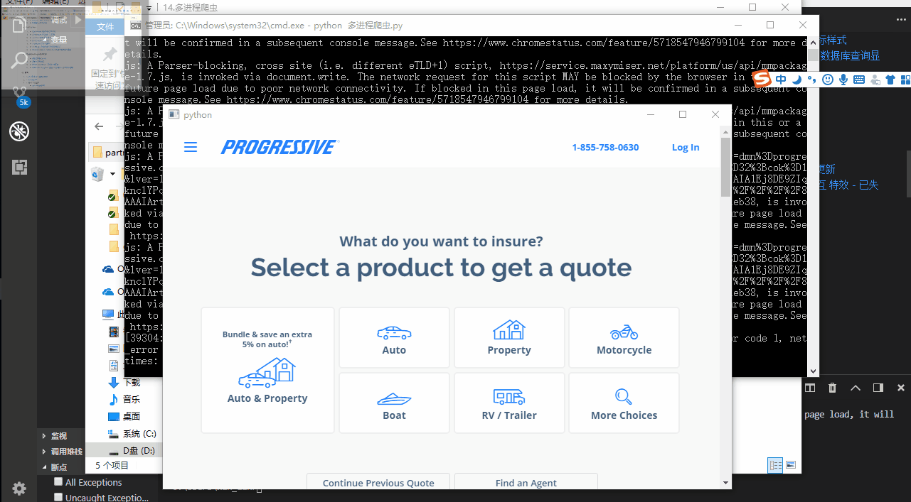

# QWebEngineView 开启控制台

需要在 设置环境变量 ， 并在浏览器中访问 ， 因为访问的是网页 ，并且扩展工具选择页面元素 会加一个 动态高亮的样式类 ， 所以可以用这个方法 来获取页面 元素的html相关属性元素。

```python
if __name__ == "__main__":
    ...

    import os
    os.environ["QTWEBENGINE_REMOTE_DEBUGGING"] = "9000"

    ...

```

