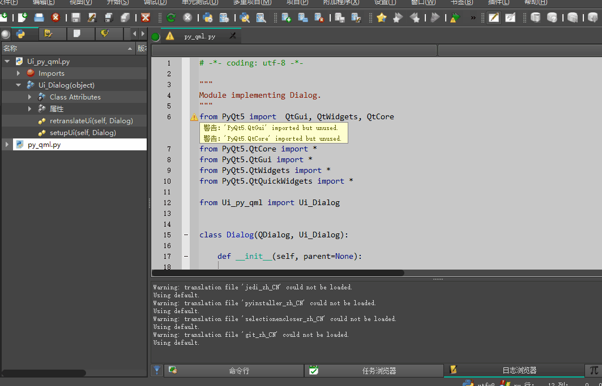

# QDialog中嵌入QML界面并缩放控件

使用 QQuickWidget()和QQuickView 嵌入的话.qml文件根节点不能为 Window 和ApplicationWindow,  
只能为 Rectangle 或Item。  
见 [QMainWindow中嵌入QML ApplicationWindow界面并缩放控件](../QQmlApplicationEngine之qml嵌入qtwidget_qt5.8以上)  

