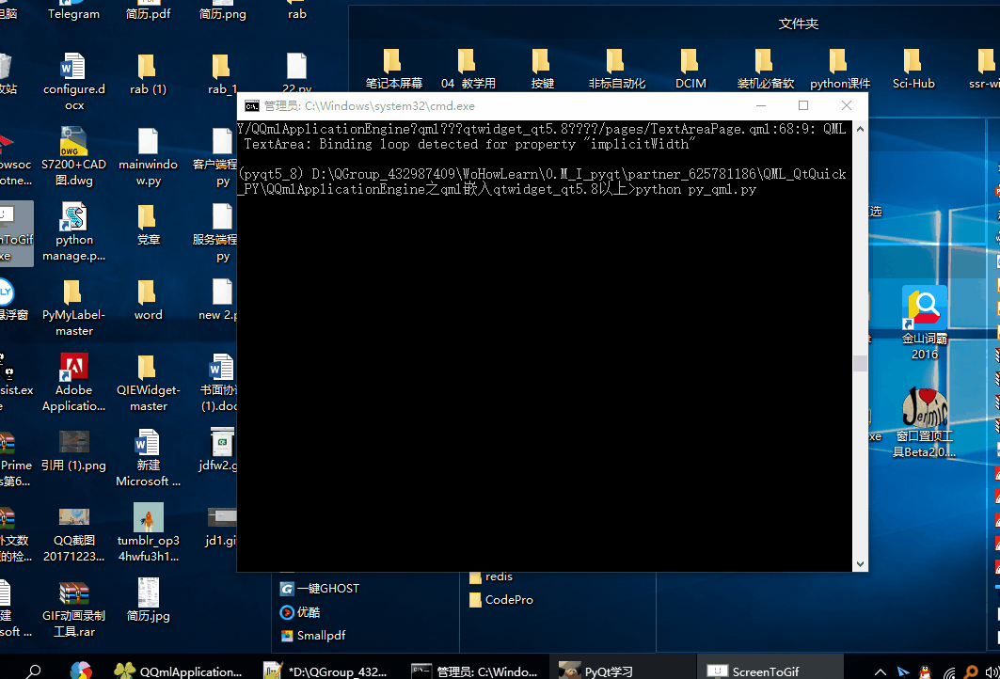

# QMainWindow中嵌入QML ApplicationWindow界面并缩放控件  

- 暂时只适用于5.8版本 ， 5.9及以上界面会漂移 ； 5.8以下 python导入Qt.labs.controls 1.0 会报错。
- 使用 QQuickWidget()和QQuickView 嵌入的话.qml文件根节点不能为 Window 和ApplicationWindow ,  只能为 Rectangle 或Item。  
- QQmlApplicationEngine  支持 Window 和ApplicationWindow 。
- py_mqltest1.qml 文件为测试文件 , 如果py_mqltest1.qml文件报错,  
可将py_mqltest1.qml更名为py_mqltest1.qml进行测试。  

