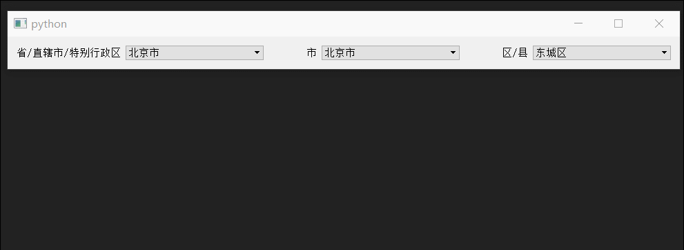

# 下拉框

## [1、QComboBox下拉数据关联](下拉选择联动)

这里简单的做了一个省市区关联的三级联动，数据源在data.json中

1. 主要用了`QComboBox`的`setModel`设置一个`QSortFilterProxyModel`过滤模型
2. 并根据唯一编码过滤，为了不影响内容显示，唯一编码的角色为`ToolTipRole`
3. 匆忙中写出来，可能有些不完善，或者该方式效率不是很高（后来发现可以用`QColumnView`实现）

