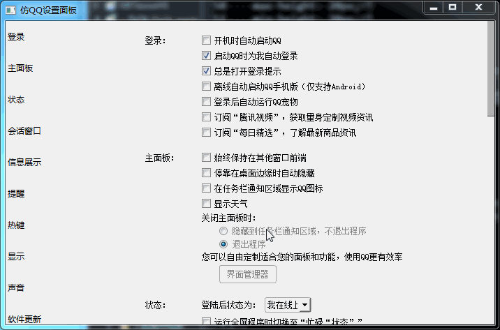

# 仿QQ设置面板简单例子

左侧：
使用QListWidget点击左侧时得到索引，然后根据索引去找右侧的widget_0之类的

右侧：
使用QScrollArea控件，设置QVBoxLayout布局，然后一次添加Widget

事件：
 - 1. 绑定左侧QListWidget的itemClicked的到该item的索引
 - 2. 绑定右侧滚动条的valueChanged事件得到pos

注意：当itemClicked时定位滚动条的值时，需要设置一个标志位用来避免valueChanged重复调用item的定位

## 截图
