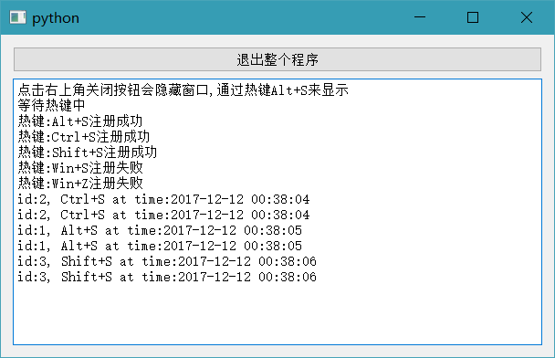

# PyQt全局热键 For Windows Test

 能监听热键,但是有个问题就是其它程序无法接受到事件 
 比如Ctrl+S,在记事本里随便输入内容按下Ctrl+S发现无法保存 

这里还有个比较好的例子<a href="https://github.com/yeejlan/py-stock-watcher/blob/87a7b7cfdeb01b44058fac6906c9cce5fd19cac0/modules/hotkey.py">hotkey.py</a>

# 截图
