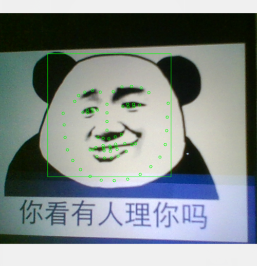

# Opencv 人脸描点检测

简单联系PyQt 结合 Opencv 进行人脸检测；
由于直接在主线程中进行特征点获取，效率比较低

### 依赖文件
 - [opencv](https://www.lfd.uci.edu/~gohlke/pythonlibs/#opencv)
 - [numpy](https://www.lfd.uci.edu/~gohlke/pythonlibs/#numpy)
 - [dlib](http://dlib.net/)
  - [dlib-19.4.0.win32-py2.7.exe](dist/dlib-19.4.0.win32-py2.7.exe)
  - [dlib-19.4.0.win32-py3.4.exe](dist/dlib-19.4.0.win32-py3.4.exe)
  - [dlib-19.4.0.win32-py3.5.exe](dist/dlib-19.4.0.win32-py3.5.exe)
 - [shape-predictor-68-face-landmarks.dat.bz2](http://dlib.net/files/shape_predictor_68_face_landmarks.dat.bz2)

截图

