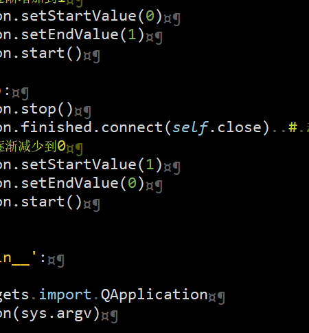
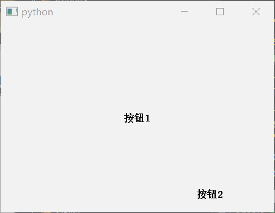

# 动画特效

使用QPropertyAnimation属性类动画（支持的属性有限）

## [1、窗口淡入淡出](窗口淡入淡出.py)

1. 使用`QPropertyAnimation`对窗口的`windowOpacity`透明度属性进行修改
1. 窗口启动时开启透明度0-->1的动画
    1. 尝试先取消动画完成后关闭窗口的信号（使用同一个动画对象，在关闭窗口动画的时候连接了动画结束后关闭窗口的信号）
    1. 停止旧动画开启新动画
1. 窗口关闭时开启透明度1-->0的动画
    1. 停止就动画
    1. 绑定动画完成后`finished`信号连接到`close`关闭窗口函数


   
## [2、右键菜单动画](右键菜单动画.py)

1. 使用`QPropertyAnimation`对菜单控件的`geometry`属性进行修改
1. 当菜单事件`contextMenuEvent`触发时调用动画启动，同时显示菜单


   
## [3、按钮放大缩小动画](按钮放大缩小动画.py)

1. 使用`QPropertyAnimation`对按钮的`geometry`属性进行修改
1. 针对按钮在布局中或者没有在布局中两种情况，需要对主窗口的`showEvent`和`resizeEvent`两个事件进行重写，从而达到更新按钮的最新`geometry`值
1. 主动调用按钮的`updatePos`函数来更新`geometry`值

比如：

```python
def showEvent(self, event):
    super(TestWindow, self).showEvent(event)
    # 更新按钮的位置
    self.button1.updatePos()
    # 针对不在控件中的按钮
    self.button2.move(self.width() - self.button2.width() - 15,
                      self.height() - self.button2.height() - 10)
    self.button2.updatePos()

def resizeEvent(self, event):
    super(TestWindow, self).resizeEvent(event)
    # 更新按钮的位置
    self.button1.updatePos()
    # 针对不在控件中的按钮
    self.button2.move(self.width() - self.button2.width() - 15,
                      self.height() - self.button2.height() - 10)
    self.button2.updatePos()
```



## [4、点阵特效](点阵特效.py)

1. emmm,我也不知道这个动画叫啥名字,反正就是仿照网页做的
1. 参考js源码,大概的原理就是:
    1. 先根据窗口大小随机创建一些点
    1. 遍历这些点找到跟它自己关联的点
    1. 动画开始画圆点、画连线
    1. 动画改变这些点的透明度, 用到了属性动画`QPropertyAnimation`
1. 这里没有仔细去研究js里的算法优化,在浏览器里嗖嗖的就生成了,在py里好慢....
1. 尽量在py里优化了循环操作,也简单的做了个cython加速也才提高了1s ? 1倍?...
1. 不要为了xx用这玩意儿,和网页的效果一样,占CPU !!!!!!
1. 如果有更好的优化算法请告知, 3Q
1. PS: pyd是python3.4生成的,删掉pyd也能运行

这部分是js的核心
```js
// for each point find the 5 closest points
for(var i = 0; i < points.length; i++) {
    var closest = [];
    var p1 = points[i];
    for(var j = 0; j < points.length; j++) {
        var p2 = points[j]
        if(!(p1 == p2)) {
            var placed = false;
            for(var k = 0; k < 5; k++) {
                if(!placed) {
                    if(closest[k] == undefined) {
                        closest[k] = p2;
                        placed = true;
                    }
                }
            }

            for(var k = 0; k < 5; k++) {
                if(!placed) {
                    if(getDistance(p1, p2) < getDistance(p1, closest[k])) {
                        closest[k] = p2;
                        placed = true;
                    }
                }
            }
        }
    }
    p1.closest = closest;
}
```

这部分是py的核心
```python
def findClose(points):
    plen = len(points)
    for i in range(plen):
        closest = [None, None, None, None, None]
        p1 = points[i]
        for j in range(plen):
            p2 = points[j]
            dte1 = getDistance(p1, p2)
            if p1 != p2:
                placed = False
                for k in range(5):
                    if not placed:
                        if not closest[k]:
                            closest[k] = p2
                            placed = True
                for k in range(5):
                    if not placed:
                        if dte1 < getDistance(p1, closest[k]):
                            closest[k] = p2
                            placed = True
        p1.closest = closest
```


## [5、图片轮播动画](多页面切换动画/图片轮播动画.py)

1. 使用`QPropertyAnimation`对`QStackedWidget`中的子控件进行pos位移操作实现动画切换特效
1. 主要代码参考http://qt.shoutwiki.com/wiki/Extending_QStackedWidget_for_sliding_page_animations_in_Qt
1. 增加了自动切换函数

函数调用:

1. `slideInNext` 下一页
1. `slideInPrev` 上一页
1. `setCurrentIndex` 切换到指定页
1. `autoStart(msec)`  轮播模式, 默认是3000毫秒

