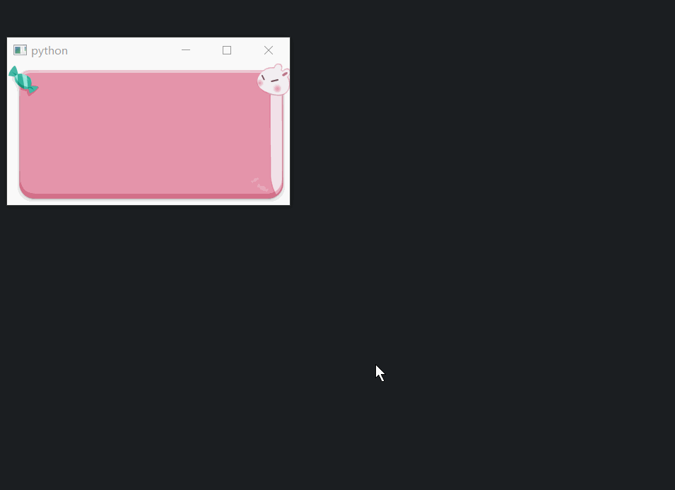

# 图片

## [1、图片加载](图片加载/)
通过3种方式加载图片文件和显示gif图片

1. 通过QPixmap("xxx.jpg")加载
2. 通过pyrcc5转换res.qrc为res_rc.py文件，可以直接import加载
    1. 转换命令pyrcc5 res.qrc -o res_rc.py
    2. import res_rc
    3. 此时可以通过QPixmap(":/images/head.jpg")来加载
3. 通过rcc命令转成为二进制文件res.rcc
    1. 转换命令tools/rcc.exe -binary res2.qrc -o res.rcc
    2. 这里把资源前缀修改下(/myfile),见res2.qrc文件
    3. 通过QResource.registerResource("res.rcc")注册
    4. 此时可以通过QPixmap(":/myfile/images/head.jpg")来加载
4. 通过xpm数组加载
    1. 通过工具tools/Image2XPM.exe来转换
    2. 这里把转换的xpm数组直接放到py文件中当做一个变量
    3. 见xpmres.py中的image_head
    4. 此时可以通过QPixmap(image_head)来加载
    5. 通过QMovie加载gif图片

## [2、仿网页图片错位特效](仿网页图片错位特效.py)

## [3、显示.9格式图片](显示.9格式图片/)
详情见子目录[显示.9格式图片](显示.9格式图片/)里

