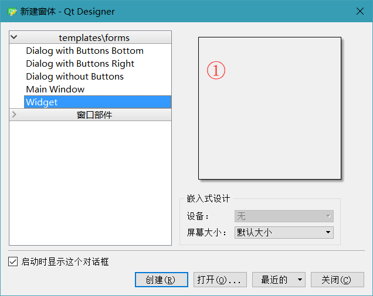
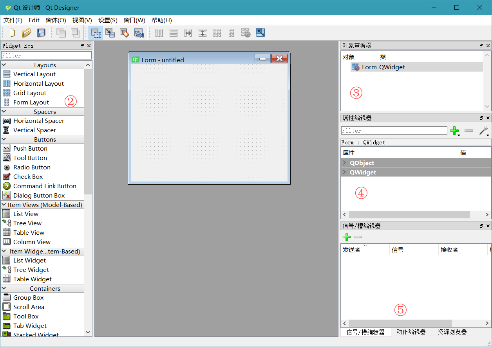

# 认识设计师

* 1、启动对话框（常用的QDialog，QMainWindow, QWidget）见①
    * Dialog with Buttons Bottom（在下方有两个按钮的对话框）
    * Dialog with Buttons Right（在右边有两个按钮的对话框）
    * Dialog without Buttons（不带按钮的对话框）
    * Main Window（标准的主界面窗口，带有菜单栏，状态栏，浮动窗口等等）
    * Widget（所有控件的基类，一般用于当作容器）

* 2、设计师界面分布（见②③④⑤）
    * 左侧②是常用控件区域，拖动放到中间
    * ③是当前的控件对象
    * ④当前控件的属性设置（比如设置大小、文字之类的）
    * ⑤该区域为信号槽设计、图片等文件资源设计、动作设计器（后面在详细讲）

