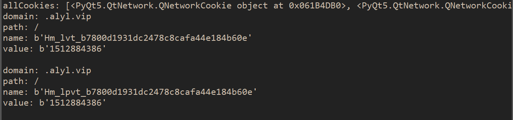
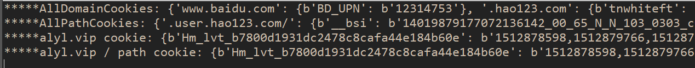

# 获取QWebView或者QWebEngineView的网页Cookie

 - QWebView很简单,从page()中得到QNetworkAccessManager,在从中得到QNetworkCookieJar,
最后得到cookie,当然也可以设置自己的QNetworkCookieJar
 - QWebEngineView的话目前是通过QWebEngineProfile中得到的cookieStore并绑定它的cookieAdded信号来得到Cookie

# 截图

