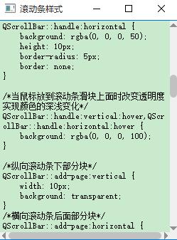

# QScrollBar滚动条样式美化

### 滚动条分两个方向
 - horizontal 横向
 - vertical 纵向
 
### 简单说明
 - 横向或纵向滚动条整体，也就是（horizontal、vertical）
 - 滚动条上面的小滑块（handle）
 - 纵向上部、横向左侧区域（sub-page）
 - 纵向下部、横向右侧区域（add-page）
 - 纵向上部、横向左侧三角形区域（sub-line）
 - 纵向下部、横向右侧三角形区域（add-line）
 - 纵向上部、横向左侧三角形（up-arrow、left-arrow）
 - 纵向下部、横向右侧三角形（down-arrow、right-arrow）

截图

