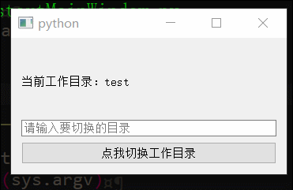
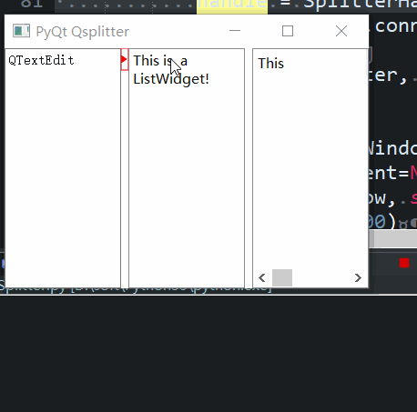
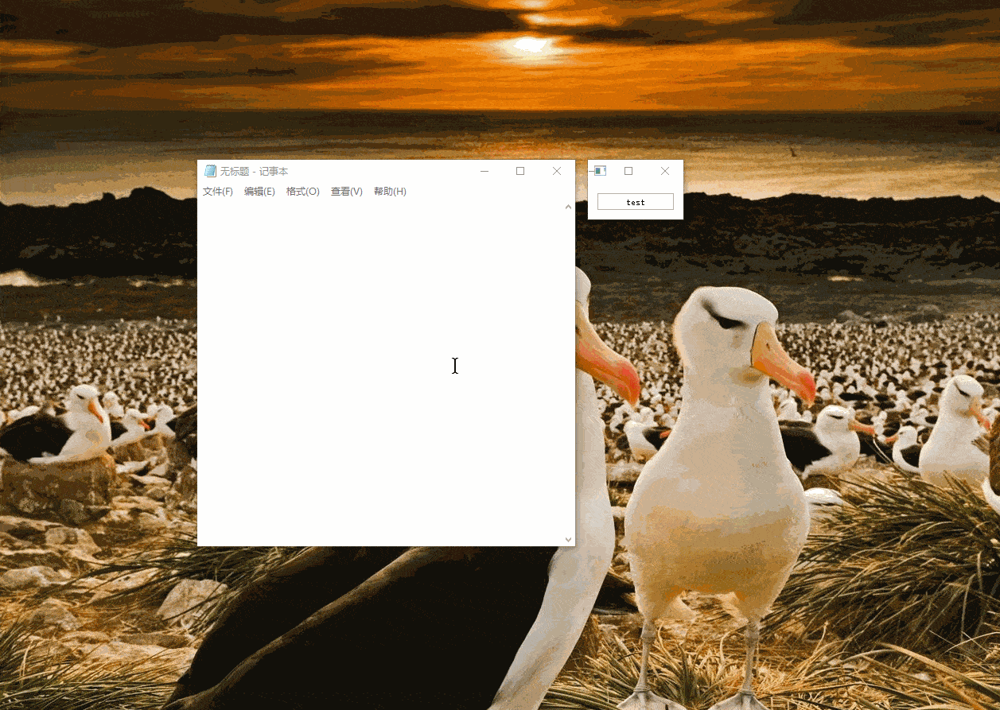

# 重启窗口Widget

# 截图

# 分割窗口的分割条重绘

原理在于QSplitter在创建分割条的时候会调用createHandle函数

于是通过重新写createHandle返回自己的QSplitterHandle类

并通过QSplitterHandle的paintEvent实现绘制其它形状，
重写mousePressEvent和mouseMoveEvent来实现鼠标的其它事件

## 截图

# 简单的窗口贴边隐藏

## 大概思路
 - 1.思路是当窗口进入左边，顶部，右边一半时，此时判断窗口的坐标
 - 2.如果窗口的x坐标小于0 则需要隐藏到左边
 - 3.如果窗口的y坐标小于0 则需要隐藏到顶部
 - 4.如果窗口的x坐标大于屏幕宽度-窗口宽度/2 则需要隐藏到右边

## 事件
 - 1.mousePressEvent，鼠标按下事件，主要记录按下的坐标
 - 1.mouseMoveEvent，鼠标移动事件，用于移动窗口
 - 1.mouseReleaseEvent，鼠标弹起事件，用于判断是否需要隐藏窗口
 - 1.enterEvent，鼠标进入事件，用于窗口隐藏后，是否需要暂时显示预览
 - 1.leaveEvent，鼠标离开事件，用于窗口暂时显示后自动隐藏效果

 
 
 # 内嵌外部窗口

### 原理思路：
 - 1.使用SetParent函数设置外部窗口的parent为Qt的窗口
 - 2.Qt使用QWidget.createWindowContainer(QWindow.fromWinId(窗口ID))生成QWidget
 - 3.使用GetWindowLong得到原来窗口的样式属性（style = win32gui.GetWindowLong(hwnd, win32con.GWL_STYLE)和exstyle = win32gui.GetWindowLong(hwnd, win32con.GWL_EXSTYLE)）
 - 4.这里还原窗口后不会显示，用spy++发现没有了WS_VISIBLE样式（未解决）

截图

# 简单跟随其它窗口

1、利用win32gui模块获取目标窗口的句柄

2、通过句柄获取目标窗口的大小位置，并设置自己的位置

3、当句柄失效时关闭自己

4、主要是检测时间，在10毫秒以下很流畅

截图

# 简单探测窗口和放大截图

利用win32gui模块获取鼠标所在位置的窗口大小(未去掉边框)和rgb颜色, 主要思路是利用一个全屏的全透明鼠标穿透的窗口（目的在于绘制矩形框和截图）

截图

