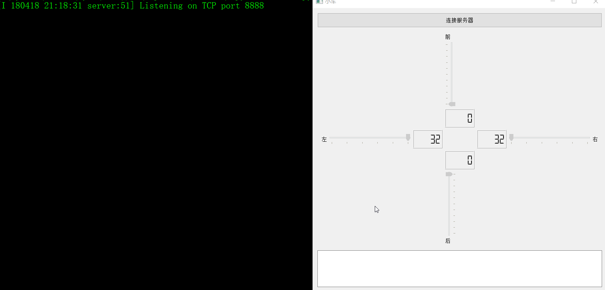

# 通过TCP连接树莓派控制小车的简单例子

需求：

 - 通过TCP连接到树莓派控制小车前后左右
 - 前进：0-100， 发送命令为F:2
 - 后退：0-100， 发送命令为B:2
 - 向左：32-42， 发送命令为L:2
 - 向右：42-52， 发送命令为R:2

注意：

 - 这里只用了UI文件做界面，并没有转换为python代码
 - server.py只是做个本地echo服务器用来测试命令是否正常，依赖tornado库，可以通过pip install tornado来安装
 - 另外需要做粘包处理，以（\n）作为粘包符

说明：

 - QTcpSocket.connected    服务连接成功后触发该信号
 - QTcpSocket.disconnected 服务器丢失连接触发该信号
 - QTcpSocket.readyRead    服务器返回数据触发该信号
 - QTcpSocket.error        连接报错触发该信号（连接超时、服务器断开等等）

## 截图
