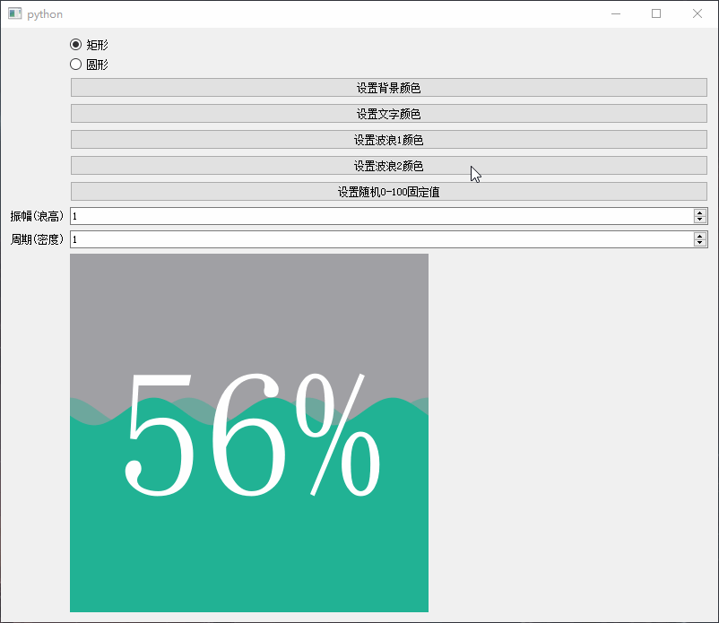
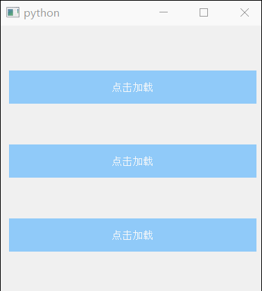
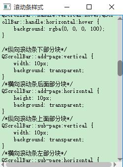
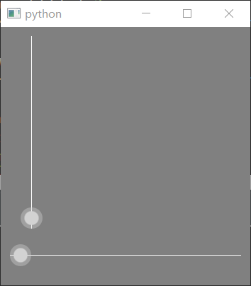

# 界面美化

## [QCalendarWidget](QCalendarWidget/)

对日历控件的部分控件进行QSS美化，顶部背景颜色和高度，上下月按钮、月份选择、年选择、菜单
[CalendarWidget.py](QCalendarWidget/CalendarWidget.py)

## [QFileSystemModel](QFileSystemModel/)

修改`QFileSystemModel`的文件类型图标

使用`QFileSystemModel.setIconProvider(QFileIconProvider)`来设置图标提供类

通过重写`QFileIconProvider`的`icon`方法来决定返回什么样的图标

见需求 [Issues#2](https://github.com/PyQt5/PyQt/issues/2)

## [QLabel](QLabel/)

### 1. [圆形图片](QLabel/圆形图片.py)

使用`QPainter`的`setClipPath`方法结合`QPainterPath`对图片进行裁剪从而实现圆形图片。

## [QMessageBox](QMessageBox/)

美化按钮以及增加图片显示

### 1. [方案一](QMessageBox/方案一)
1. 该方案使用`dialogbuttonbox-buttons-have-icons: 1;`开启自带的图标样式
2. 再利用`dialog-xx-icon: url();`来设置自定义的图标, 具体参考[list-of-icons](http://doc.qt.io/qt-5/stylesheet-reference.html#list-of-icons)
3. 缺点 部分按钮图标无效，无法自定义不同按钮的颜色

### 2. [方案二](QMessageBox/方案二)
1. 采用样式表中的属性选择器`QPushButton[text="xxx"]`可以根据按钮中的文字来区分
2. 在利用属性样式`qproperty-icon: url();`来设置自定义图标
3. 解决方案一的缺点

## [QProgressBar](QProgressBar/)

各种进度条的美化和自定义

### 1. [简单样式表美化](QProgressBar/简单样式表美化.py)
主要改变背景颜色、高度、边框、块颜色、边框、圆角

### 2. [水波纹进度条](QProgressBar/水波纹进度条/)

### 3. [圆圈进度条](QProgressBar/圆圈进度条.py)

### 4. [百分比进度条](QProgressBar/百分比进度条.py)

### 5. [Metro进度条](QProgressBar/Metro进度条.py)

## [QPushButton](QPushButton/)

### 1. [按钮常见样式](QPushButton/按钮常见样式.py)

主要改变背景颜色、鼠标按下颜色、鼠标悬停颜色、圆角、圆形、文字颜色

### 2. [按钮进度动画](QPushButton/按钮进度动画)

1. [按钮字体旋转动画](QPushButton/按钮进度动画/按钮字体旋转动画.py)

    利用字体，使用FontAwesome字体来显示一个圆形进度条，然后利用旋转动画

    

2. [按钮底部线条动画](QPushButton/按钮进度动画/按钮底部线条动画.py)

    在按钮下方画一条线，根据百分值绘制

    

## [QScrollBar](QScrollBar/)

使用QSS和图片对滚动条进行美化

## [QSlider](QSlider/)

### 1. [通过QSS美化](QSlider/QssQSlider.py)

### 2. [paintEvent绘制](QSlider/PaintQSlider.py)

## [Effect](Effect/)
特效

### 1. [图片按钮输入框阴影](Effect/图片按钮输入框阴影.py)
1.通过`setGraphicsEffect`设置控件的边框阴影
2.继承`QGraphicsDropShadowEffect`实现增加动态属性`radius`
3.通过`QPropertyAnimation`属性动画不断改变`radius`的值并调用`setBlurRadius`更新半径值

## [QWidget](QWidget/)
解决继承后的QWidget无法设置样式

 - 1.重写paintEvent
 - 2.设置Qt.WA_StyledBackground属性

